# PPR Level 2 Certification Study Guide  

About the PPR Level 2 Certification 9   
Comparison of Level 1 and Level 2 10   
Preparation 11   
Equipment 11   
Safety 12   
First Aid 14   
Grip Review 16   
General 16   
The Continental Grip 17   
Continental Grip Video 19   
The Eastern Grip 20   
Eastern Grip Video 22   
The V-Shape Grip 23   
V-Shape Grip Video 24   
The Hourglass Lesson Format 26   
Lesson Timeline 26   
Opening the Lesson 27   
Introduction 27   
Warm-Up 27   
Athlete Activation 27   
Dynamic Stretching 28   
Athletic Skill Build 29   
Paddle Hits 29   
Skill Development 31   
Swing Volley 31   
Technique 31   
Consistency 33   
Accuracy 35  

# 6  

Swing Volley Video 36   
Blocking 37   
Counter Attack 38   
Blocking & Counter Attacking Video 40   
Handling Power 41   
The Lob 42   
Technique 42   
Consistency 44   
Accuracy 45   
Offensive Lob 46   
Defending the Lob 48   
Lob Video 50   
Overhead 50   
Overhead Safety 53   
Executing the Overhead 53   
Defending the Overhead 54   
Overhead Placement 55   
Overhead Videos 57   
Around the Post 57   
Defending the ATP 59   
Around the Post Video 60   
Around The Post Play by Play 61   
Erne 61   
Defending the Erne 63   
Erne Video 65   
ntroduction of Advanced Strategies 65   
Creating Opportunities in the Middle 66   
Dinking to the Middle 66   
Using the Outside Quadrants to Open the Middle 67   
Middle Strategy Videos 69   
Transition Zone Strategy 69   
Transition Zone Video 71  

3rd Shot Drive 72   
Technique 72   
Consistency 74   
Accuracy 74   
Placement 76   
Strategy 77   
3rd Shot Drop 78   
Strategic Placement 78   
3rd Shot Drop Videos 80   
4th Shot Strategy 80   
4th Shot Video 81   
Transition Zone Strategy 82   
Transition Zone Transitioning 82   
The Zones of the Transition Zone 84   
Transition Zone Video 85   
Transition Zone Video 86   
Acceleration and Deceleration in the Transition Zone 87   
Accelerating Movement in the Transition Zone 87   
Decelerating Movement in the Transition Zone 88   
General Considerations for Transition 89   
Accelerate / Decelerate Transition Zone Video 89   
Poaching 90   
When to Poach 91   
Considerations for Poaching 92   
After Poaching 92   
Poaching Video 93   
Serve 93   
Serving Down the “T” 93   
Serve Down the “T” Diagrams 95   
Lob Serve 97   
Serving Videos 98   
Returning the Serve 98   
Return Down the Line 98   
Return Positioning 99   
Return Variety 100   
Return Video 102   
Stacking 103   
Signal 104   
Half 106   
Return Placement when Stacking 107   
Stacking Videos 109   
Timing and Trust When Playing Doubles 110   
Identify Strengths - Individual and Team 111   
Expose Weaknesses of Opponent(s) 114   
Closing the Lesson 117   
Static Cool Down 117   
Lesson Recap 118   
Homework 121   
Pickleball Drills 122   
Pickleball Games 125   
Conclusion 127  

# About the PPR Level 2 Certification  

The purpose of the Level 2 Certification is to teach coaches how to use tactical competencies, in conjunction with the technical competencies introduced in Level 1, and to help coaches take players from Improver (3.5) to Advanced $(4.0+)$ . In this comprehensive program, we will explore transition zone tactics, including staggered positioning and shot placement. Coaches will learn how to teach players to create opportunities using the middle of the court as a weapon, to better understand stacking strategies, and to enhance their skills with specialty shots like the ATP and the Erne. The course also includes engaging games and drills to reinforce these concepts. In the educational materials (video, study guide, etc.), we integrate the five key tactical competencies: consistency, accuracy, positioning, playing to strengths, and exploiting opponents' weaknesses, ensuring a well-rounded coaching approach. Transform your coaching skills and empower your players to reach new heights with the knowledge and strategies you will learn in Level 2!  

# Comparison of Level 1 and Level 2  

What is the difference between Level 1 and Level 2 PPR Pickleball Certifications? Level 1 Certification focuses on coaching Adult Beginners and Improvers. It covers coaching philosophy, understanding adult learners, the technical competencies of the game with an introduction to the tactical competencies, safety, and organizing instructional sessions (the “Hourglass”). Comparatively, Level 2 Certification, as previously mentioned, advances players from Improver (3.5) to Advanced $(4.0+)$ , focusing more on tactical skills, grip techniques, non-volley zone (NVZ) tactics, transition zone strategies, stacking techniques, and specialty shots.   
In essence, Level 1 establishes foundational coaching skills and techniques for   
Beginners, while Level 2 builds on this foundation with more advanced tactics and strategies for higher-level players.  

Like the Level 1 certification, the Level 2 workshop is in-person and includes a skill assessment and a lesson assessment. In addition, there is also a written assessment to be completed after the workshop.  

# Preparation  

# Equipment  

For effective and safe recreational or competitive play, one must have the right equipment.  

Here is a list of essential items:  

1. Pickleball Paddle: Choose a paddle that feels comfortable in your hand, with the right weight and grip size for your style of play.   
2. Pickleball Balls: There are balls specifically designed for pickleball, differing for indoor and outdoor play. Ensure you have the appropriate type.   
3. Proper Footwear: Wear court shoes that provide good support and traction to prevent slips and falls. Pickleball involves a lot of lateral movement, so proper shoes are crucial.   
4. Comfortable Clothing: Wear lightweight, breathable athletic clothing that allows easy movement.  

5. Protective Eyewear: Important for pickleball players of all levels to wear protective eyewear to avoid injury from a paddle swing, flying balls and / or balls ricocheting off of a paddle.  

6. Sun Protection: If playing outdoors, use sunscreen, sunglasses, and a hat or visor to protect against sun exposure.  

7. Water Bottle: Stay hydrated, especially during long games or in hot weather.  

8. First Aid Kit: Have a basic first aid kit handy for minor injuries like cuts or scrapes.  

9. Gloves: Some players prefer gloves to improve grip and protect their hands.  

10.Durable Bag: A good sports bag to carry and protect your equipment.  

The needs of players may vary based on personal preferences, skill level, and playing conditions. It is always a good idea to invest in quality equipment that enhances your performance while keeping you safe on the court.  

# Safety  

Safety when playing pickleball is important to prevent injuries and ensure an enjoyable experience.  

Here are some key safety tips:  

1. Warm-Up Properly: Before starting a game, do a proper warm-up that includes light cardio and dynamic stretching to get your muscles ready and reduce the risk of injury.   
2. Wear Appropriate Gear: Use proper court shoes that provide good support and traction to avoid slips and falls. Also, consider wearing protective eyewear to protect against ball and paddle strikes.   
3. Stay Hydrated: Drink plenty of water before, during, and after play to avoid dehydration especially on hot days.   
4. Use Sun Protection: If playing outdoors, apply sunscreen, wear sunglasses, and consider a hat to protect against sunburn.   
5. Understand and Follow the Rules: Knowing the rules of the game can help avoid dangerous play and misunderstandings on the court.   
6. Respect Non-Volley Zone Rules: Be cautious around the Non-Volley Zone (NVZ) to avoid stepping in it on volleys, which can lead to falls or ankle sprains.   
7. Be Aware of Your Surroundings: Pay attention to other players and obstacles around you to prevent collisions and falls.   
8. Know Your Limits: Play at a level and intensity that is suitable for your fitness and skill level. Overexerting yourself can lead to injuries.  

9. Maintain a Safe Playing Environment: Ensure the playing surface is clean, dry, and free of hazards like puddles, debris, or cracks.  

10. Listen to Your Body: If you feel pain or discomfort, stop playing and rest. Ignoring signals from your body can lead to more serious injuries.  

11. Stay Cool: In hot weather, take breaks in the shade and use cooling towels or fans to prevent overheating.  

12. First Aid Kit: Have access to a basic first aid kit for minor injuries.  

By following these safety tips, you can help ensure a safe and enjoyable pickleball experience for everyone involved.  

# First Aid  

When playing pickleball, it is wise to have a basic first aid kit on hand or at your facility to deal with minor injuries or emergencies.  

Here are some essential items to include in your pickleball first aid kit:  

1. Band-Aids: Various sizes for minor cuts, scrapes and blisters.   
2. Antiseptic Wipes: To clean wounds and prevent infection.   
3. Antibacterial Ointment: For treating minor cuts and scrapes.   
4. Sterile Gauze Pads and Adhesive Tape: For covering larger wounds.  

5. Elastic Bandages or Compression Wraps: For supporting sprained or strained joints like ankles or wrists.  

6. Ice Packs or Instant Cold Packs: To reduce swelling and alleviate pain from injuries.   
7. Pain Relievers: Over-the-counter pain medication like acetaminophen or ibuprofen.   
8. Blister Treatment Pads: Especially useful when breaking in new shoes.   
9. Tweezers: For removing splinters or debris from wounds.   
10.Scissors: For cutting tape or bandages.   
11. Disposable Gloves: To maintain hygiene while treating wounds.   
12.Sports Drink or Electrolyte Packets: To manage dehydration or heat exhaustion.   
13.Sunscreen and Lip Balm with SPF: If you are playing outdoors.   
14.First Aid Manual: Basic instructions on how to handle common injuries.   
15.Emergency Contact Information: Including local emergency services and contacts for all players.  

This kit should be sufficient for addressing minor injuries common in pickleball, like scrapes, blisters, or muscle strains. For more serious injuries, seek professional medical attention immediately.  

# Grip Review  

# General  

The grip used to hold the paddle is a fundamental aspect of playing pickleball effectively for several reasons:  

1. Control and Accuracy: A proper grip allows for greater control and accuracy in your shots. It helps in precisely directing the ball, whether you are serving, volleying, or hitting groundstrokes.   
2. Power: While pickleball does not rely on power as much as other racquet sports, a good grip can still help in generating more force in your shots, especially for smashes and drives.   
3. Reduced Risk of Injury: An appropriate grip can reduce the strain on your wrist, elbow, and shoulder. This is particularly important for avoiding conditions like tennis elbow, which can occur from repetitive strain.   
4. Versatility in Shots: A good grip enables you to easily switch between different types of shots, like from a forehand to a backhand, or transitioning from a groundstroke to a volley.   
5. Spin: For advanced players, a proper grip is essential for applying different spins to the ball, adding another level of strategy to the game.  

6. Comfort: A grip that feels natural and comfortable can improve your overall performance and enjoyment of the game.  

To master pickleball, it is important to experiment with different grip styles (like Continental or Eastern) to find what works best for your style of play and ensures comfort during long matches. Regular practice with the correct grip will significantly improve your game.  

# The Continental Grip  

The Continental grip in pickleball is a versatile and widely used grip, especially useful for a variety of shots. It is often referred to as the "hammer grip" due to the way the paddle is held, similar to holding a hammer.  

Here are the key elements:  

1. Grip Formation: To achieve the Continental grip, place your hand on the paddle handle so that the base knuckle of your index finger and the heel of your hand are aligned with the second bevel of the paddle handle. For a right-handed player, this would be at the 2 o'clock position on the paddle handle, and for a left-handed player, at the 10 o'clock position.  

2. Characteristics: This grip aligns the paddle perpendicular to the ground and parallel to the net when your arm is extended. It allows for easy transitions between forehand and backhand strokes without the need to change the grip.   
3. Advantages: The Continental grip is particularly effective for serves, volleys, and overhead smashes in pickleball. It provides a natural and balanced position for hitting the ball flat and straight, making it ideal for quick, reflex volleys at the net.   
4. Versatility: While the Continental grip offers great control for specific shots, it might be less effective for powerful groundstrokes, where grips like the Eastern might be more suitable. However, its ease of use for both forehand and backhand strokes makes it a favorite among players who prefer a quick and reactive play style, especially in doubles.  

5. Transition and Adaptability: Due to its neutral nature, the Continental grip allows players to quickly switch between different types of shots, making it a great choice for fast-paced games where quick reactions are crucial.  

In summary, the Continental grip is a fundamental and versatile grip in pickleball, known for its effectiveness in serving, volleying, and smashes. Its balanced and neutral positioning makes it a great choice for players looking for a grip that works well with a variety of shots, especially in fast-paced play scenarios.  

# Continental Grip Video  

https://ppr.rewatch.com/video/ymfg0bnwcuuhwlbh-continental-grips This video discusses the continental grip in pickleball, which is widely used by players for its versatility and benefits in various shots. It emphasizes the importance of positioning the thumb and index finger correctly to achieve control and mobility from the wrist. The grip is described as the key element in guiding the direction of the paddle, especially for shots like the dink, and is essential for extending the reach from the shoulder. Incorrect hand positioning, such as placing the thumb on top of the handle, is discouraged due to the risk of injuries to the wrist and elbow. The text also suggests a simple teaching method using non-dominant and dominant hands to help students understand the correct grip.  

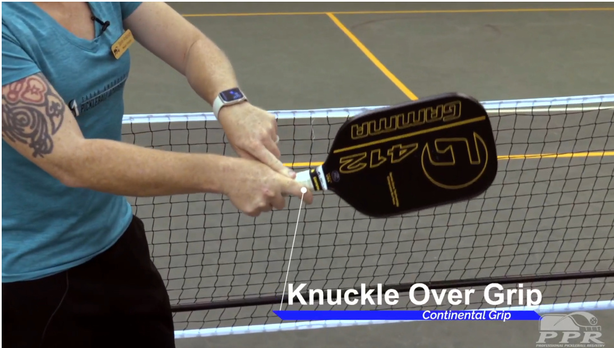  

# The Eastern Grip  

The Eastern grip in pickleball is a commonly used grip that offers a good balance between power and control, especially for forehand shots.  

Here are the key elements:  

1. Positioning: To achieve the Eastern grip, place the palm of your dominant hand so that the base knuckle of your index finger is aligned with the third bevel of the paddle handle. If you imagine the handle as the face of a clock, this would be at the 3 o'clock position for a right-handed player and 9 o'clock for a left-handed player.  

2. Grip Formation: The grip is similar to shaking hands with the paddle. Your fingers should be comfortably wrapped around the handle, and the thumb should be placed flat against the other side of the handle.  

3. Advantages: The Eastern grip is particularly effective for forehand strokes. It allows for a natural and powerful swing motion and facilitates hitting the ball with a flat paddle face, which is great for driving the ball with power. It also offers a degree of flexibility that enables players to easily switch to other shots or grips as needed.  

4. Forehand Orientation: When using the Eastern grip for a forehand shot, the paddle face will be perpendicular to the ground at the point of contact, which helps in achieving depth and power in the shots.  

5. Versatility: While the Eastern grip is favored for forehand shots, players can still use it for other types of strokes with some adjustments. However, some players may prefer to switch to a different grip, like the Continental, for backhand strokes or specific shots like dinks or lobs.  

In summary, the Eastern grip in pickleball is a popular choice for players who prefer a powerful and controlled forehand stroke. Its natural, handshake-like positioning makes it a comfortable grip for many players, especially those transitioning from sports like tennis.  

# Eastern Grip Video  

https://ppr.rewatch.com/video/lio786kiiuf72lu7-eastern-grip   
This video provides instructions for obtaining the Eastern grip for pickleball. It advises starting with a basic handshake grip and then moving the paddle towards the   
non-dominant side, positioning the knuckle slightly on one side of the bevel. This grip is commonly used by advanced players, as it is said to enhance power and stability from the wrist.  

  

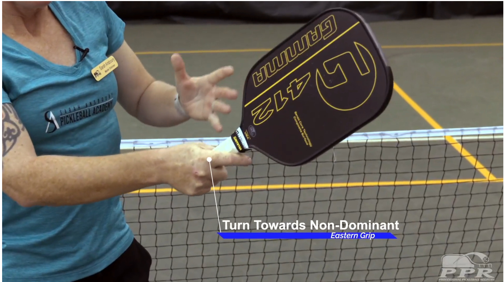  

# The V-Shape Grip  

The V-Shape grip in pickleball, also known as the "V-Grip," is a specific way of holding the paddle that is quite popular among players.  

Here are the key elements:  

1. Formation of the V-Shape Grip: This grip is named for the V-Grip formed between the thumb and the index finger on the paddle handle. When you grip the paddle, the base of your thumb and the side of your index finger create a V-Grip.  

2. Position on the Paddle: The V-Grip should align with the edge of the paddle. This alignment helps in maintaining a neutral position, which is beneficial for both forehand and backhand shots.  

3. Benefits: The V-Grip is known for providing a good balance of control and power. It allows for easier wrist movement, which is crucial for imparting spin and for quick, responsive shots. This grip is especially useful for players who prefer a more finesse-oriented game, as it offers excellent control over the angle of the paddle face and the direction of the ball.  

4. Usage: This grip is used primarily for baseline strokes and serves. It is less common for net play or dinking, where a Continental grip might be more effective. 5. Adaptability: While the V-Grip is a fundamental grip in pickleball, players often adjust their grip slightly depending on the shot they are executing. For example, they might shift to a more forehand or backhand dominant grip when necessary. In summary, the V-Shape Grip is a versatile and popular grip in pickleball, offering a good mix of control and power, and is especially effective for baseline play and serves. As with any sport, the choice of grip can be highly personal and depends on the style of play, comfort, and the specific demands of the game.  

# V-Shape Grip Video  

https://ppr.rewatch.com/video/d4r53ooyjzs7yndw-v-shaped-grip  

This video discusses a less commonly used pickleball grip known as the V-shape or table tennis grip. It is characterized by players holding the handle higher up, sometimes with shorter handles specifically designed for this grip. The grip involves placing the finger on one side of the paddle and the thumb on the other, making it suitable for backhanded players but more challenging to transition to the forehand side. It is noted that this grip is not as prevalent as the Eastern or Continental grips.  

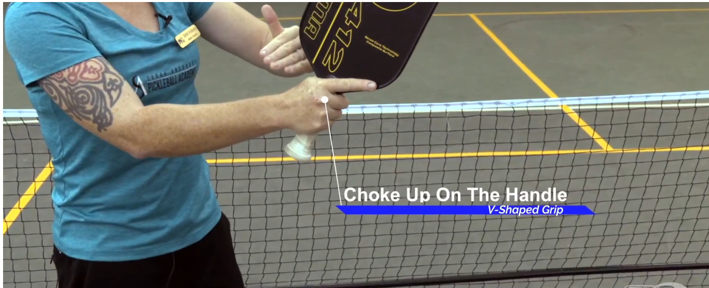  

# The Hourglass Lesson Format  

  

<html><body><table><tr><td>Open</td><td rowspan="2">Observe Analyze</td><td>thegamesituation</td></tr><tr><td>Semi-Open</td><td>whattheplayersdo</td></tr><tr><td>Closed</td><td>Teach technical</td><td>skillstoimprovethegame</td></tr><tr><td>Semi-Closed</td><td rowspan="2">Develop tactical Evaluate</td><td>skillinthegame</td></tr><tr><td>Semi-Open</td><td>theperformance</td></tr></table></body></html>  

# Lesson Timeline  

1. Introduction and Warm-Up $10\%$ : Get names and any pre-existing injuries, body warm-up (activation, dynamic stretching and athletic skill development, paddle warm-up).  

2. Skill Development $30{-}40\%$ -Open competitive play observation, generating feedback, explaining, demonstrating and teaching.  

3. Game Development $20-30\%$ : Introduce a tactic, cooperative to competitive play, use of scoring systems.  

4. Wrap-Up $10\%$ : Pick up equipment, static stretching, review lesson, preview next lesson, fun finish and thank you.  

# Technical Competencies  

# PR  

TECHNICAL Competencies:  

1. Grip  

2. Stance  

3. Paddle Prep / Shape of Shot  

4. Contact Point /Weight Transfer  

5. Non-Dominant Hand / Neutral Ready  

# Tactical Competencies  

TACTICAL Competencies:  

1. Consistency  

2. Accuracy  

3. Positioning  

4. Play to Self/Partner Strength  

5. Play Opponent Weakness  

# Opening the Lesson  

# Introduction  

Here is where the coach will facilitate introductions allowing players several minutes each to tell their name, from where they traveled or where they live, any pre-existing injuries, and a little about past sports history, if any. From there, the coach will move into the warm-up.  

# Warm-Up  

# Athlete Activation  

To activate an athlete means to prepare them physically and mentally before a sports event or training session. The activation process is aimed at priming the athlete's body and mind for optimal performance. It typically involves a series of exercises, drills, and activities that increase heart rate, enhance focus, mobilize muscles, and improve overall readiness.  

Physical activation generally involves dynamic movements like jumping, running, or agility exercises to warm up muscles, increase blood flow, and improve flexibility. This helps prevent injuries, increase range of motion, and optimize performance during the event.  

An example of physical athlete activation is to have players jog from the baseline to the net starting at $20\%$ effort and then back to the baseline from the net at $40\%$ effort and then from the baseline to the net again but this time at $60\%$ effort and then from the net to the baseline again, this time at $100\%$ effort. One could also have players do jumping jacks or skip rope for a more dynamic start. This will engage the athletes and begin to get their heart rate up and their blood pumping!  

# Dynamic Stretching  

Warming up properly before playing pickleball is crucial to prepare your body for the physical activity, enhance performance, and reduce the risk of injuries. Perform dynamic stretches to improve mobility and flexibility. Focus on major muscle groups such as legs, arms, back, and shoulders.  

Here are some examples of dynamic stretches:  

1. Hip Openers (open and closed)   
2. Arm Circles   
3. Torso Twists   
4. $60-40\%$ Lunges   
5. Monster Walks   
6. Butt Kicks  

# Athletic Skill Build  

To build or reinforce an athletic skill, have students toss and catch a decompressed tennis ball from the area of the court as a part of the overall warm-up.  

# Paddle Hits  

Start with gentle dinking at the net, gradually moving back to the baseline. Practice a variety of shots including dinks, volleys, 3rd shot drops and drives, serves, and return of serve gradually increasing intensity.  

A common paddle warm-up could include the following components  

1. Shadow swings: Mimic pickleball strokes using your paddle without a ball. Perform forehand and backhand swings, emphasizing proper technique and incorporating footwork.   
2. Forehand and Backhand Dinks: Practice hitting soft, controlled shots (dinks) off both sides with a focus on consistency and accuracy.   
3. Volley Drills: Work on volleys near the net by practicing quick reflexes, soft hands and proper paddle positioning. This is typically done with a partner or against a wall.   
4. 3rd Shot Drops/Drives: Work on hitting 3rd shot drops from the baseline to the Non-Volley Zone, aiming to land the ball softly and close to the net or low enough that the partner has to hit up on the shot.   
5. Serve and Return of Serve Practice: Players work on their serve technique and practice returning serves with a focus on consistency and accuracy.  

It is important to note that the specific warm up routine may vary depending on individual preferences and skill levels. The goal of a paddle warm up is to prepare the body and mind for pickleball play, reduce the risk of injuries, and improve overall performance on the court.  

Once the paddle warm-up is complete, coaches will put players in OPEN competitive play. This will provide the coach with an opportunity to observe students in a score-keeping game situation. It is important that this be competitive so that the coach can do a true skill assessment of all players.  

# Skill Development  

This section represents the CLOSED section of the Hourglass format where we will introduce and teach several shots that are appropriate for players moving from the 3.5 to 4.0 level.  

# Swing Volley  

This is a dynamic shot that combines elements of both a volley and a groundstroke. The Swing Volley is hit out of the air with a full swing, usually while standing near the NVZ. This is a versatile shot that can be used to put pressure on the opponents, create angles, or hit winners.  

# Technical  

Swing Volley technique in pickleball is crucial for effectively hitting the ball out of the air before it bounces on the court. This shot is typically executed near the net, typically at or close to the NVZ, but it can also be hit when transitioning. In pickleball, the volley is typically referred to as a “Swing Volley” vs a “Punch Volley” due to the rules of the game and the restrictions of the NVZ. However, there are times when the height of the ball allows for more punch than swing on a volley.  

Proper swing volley technique involves several key components for both control and power:  

1. Position: Stand with your knees slightly bent, weight on the balls of your feet, and paddle held in front of you at chest level. This position allows for quick movements and reactions.  

2. Grip and Paddle Position: Hold the paddle with a firm yet relaxed grip. The paddle face should be open (angled slightly upwards) for most volleys to ensure the ball clears the net.   
3. Minimal Backswing: Unlike groundstrokes, volleys require very little backswing. The power comes from the speed of the ball and a firm, controlled movement of the paddle.   
4. Paddle Movement: Use a short, slight swinging motion for the volley. The movement is more about guiding the ball rather than winding up and swinging hard.   
5. Contact Pointt: Make contact with the ball in front of your body. This helps with accuracy and control.   
6. Follow Through: Keep the follow-through short and controlled. Overextending can lead to loss of control over the shot. Return to neutral to be prepared for the next shot.   
7. Non-Dominant Hand: Use your body to add power to the volley, especially for aggressive volleys. This involves a slight forward movement of the body and a transfer of weight from the back foot to the front foot.   
8. Shot Placement: Aim your volleys deliberately, whether you are trying to hit them away from your opponent or into difficult-to-reach areas.  

9. Quick Feet: Good footwork is essential. Be ready to move quickly to position yourself optimally for each volley.  

10. Anticipation and Reaction: Be alert and ready to react quickly to your opponents' shots, as volleys often occur in fast-paced exchanges. Mastering volley technique is essential for success in pickleball, especially in aggressive net play. It allows a player to take charge of the rally, creating opportunities for winning points and putting pressure on the opponents.  

# Swing Volley - Technical Video  

https://ppr.rewatch.com/video/bz7fnb515gjw5csg-swinging-volley  

This video discusses the swinging volley in pickleball. It emphasizes the importance of grip, foot positioning, and weight distribution. The speaker recommends an open stance with the toes pointed in the direction of the ball, and proper paddle preparation with extended elbows. The contact point should be in front of the body, and weight transfer should guide the direction of the shot. The finish involves keeping the non-dominant hand on the same plane as the paddle and finishing in a forward motion, while extending out and away to protect the body.  

# Tactical  

# Consistency  

Volley consistency refers to the ability to reliably and effectively execute volley shots throughout a game or match. Consistency in volleying is crucial for maintaining control during rallies and effectively countering the opponents' play.  

Key elements of volley consistency include:  

1. Controlled Shot Placement: Regularly placing volleys accurately, whether it is directing them to specific areas of the court to challenge opponents or keeping them away from opponents’ strengths. As the level of play increases, consistency evolves from number of shots in the court to number of shots to a specific target.   
2. Steady Paddle Work: Maintaining a firm wrist and stable paddle face when contacting the ball, which is essential for controlling the direction and speed of the volley.   
3. Positioning and Footwork: Being in the right position to effectively volley, which often means staying close to the NVZ line. Good footwork is essential for quick adjustments.   
4. Adaptability: The ability to adjust volleys based on the pace and angle of the incoming ball, as well as to the positioning and playing style of the opponents.  

5. Reduced Errors: Consistently executing volleys without faults like hitting the ball into the net or out of bounds.  

6. Strategic Awareness: Understanding when to use a soft, controlled volley to reset the point or a hard, aggressive volley to take control of the rally.  

Developing volley consistency is important for pickleball players at all skill levels, as it provides a reliable foundation for both defensive and offensive play at the net. A player who can consistently volley well is often able to dictate the pace and flow of the game.  

# Accuracy  

Volley accuracy refers to the precision with which a player executes their volley shots. Accuracy in volleying is crucial for placing the ball effectively to challenge opponents, control the point, and minimize the risk of unforced errors.  

Key aspects of volley accuracy include:  

1. Precise Placement: Skillfully directing the ball to targeted areas of the court, whether it is to exploit an opponents' weaknesses, keep opponents off-balance, or set up for a winning shot.   
2. Controlled Angles: The ability to manage the angle of the paddle and the point of contact to guide the ball accurately, whether for cross-court shots, down-the-line shots, or sharp angles.  

3. Depth Control: The ability to hit the volley with enough depth to make it challenging for opponents to return, but with the control needed to keep the ball in play.  

4. Strategic Shot Selection: Choosing the right type of volley (soft touch volley to drop the ball in the kitchen, or a hard drive volley for an aggressive play) based on the dynamics of the rally and the positioning of the opponents. 5. Adjusting to Ball Speed and Spin: Modifying the volley technique to accommodate the incoming ball pace and spin, ensuring accurate returns. 6. Consistency Under Pressure: Maintaining accuracy even in high-pressure situations or during fast-paced exchanges at the net.   
Improving volley accuracy is important for players looking to enhance their performance   
in pickleball, as it allows for more control over rallies and increases the likelihood of nning points through strategic shot placement.  

# Tactical  

# Blocking  

Blocking refers to a defensive shot used to neutralize an opponent's powerful or aggressive shot, particularly a smash or a hard-driven ball. The goal of a block shot is to absorb the power of the incoming ball and return it gently over the net, ideally placing it in a way that makes it difficult for the opponent to attack again. This shot is crucial when you are at the net and need to defend against fast-paced volleys or smashes. Key aspects of blocking in pickleball include:  

1. Soft Hands: Relaxing your grip on the paddle and using soft hands is essential. This allows the paddle to absorb some of the energy from the ball, reducing the speed as it rebounds.   
2. Paddle Position: Keep your paddle up and in front of you, positioned between your body and the net. This ready position allows for quick reaction to fast shots.   
3. Minimal Movement: A block shot requires very little paddle movement. It is more about positioning the paddle correctly and allowing the ball to hit the paddle, rather than swinging at the ball.   
4. Angle of the Paddle: Slightly angle the paddle face upwards to ensure the ball clears the net. The angle also helps to control the direction of the block volley.   
5. Body Position: Stay balanced with your knees slightly bent. Move your body as a unit to align with the ball, rather than just reaching with your arm.   
6. Strategic Placement: Aim to place your block shot where it will be most challenging for the opponent to attack again, often in the NVZ or at their feet.   
7. Controlled Follow Through: The follow-through should be minimal to maintain control over the shot.  

8. Quick Recovery: After executing the block, be prepared to quickly respond to the next shot, as effective blocking often leads to continued volley exchanges.  

Blocking is a skill that requires practice, as it involves precise timing and control, especially when dealing with powerful shots. Mastering this technique can significantly enhance your defensive play in pickleball.  

# Counter Attack  

Counter attacking refers to the strategy of responding aggressively to an opponent's attack, turning a defensive situation into an offensive opportunity. This involves quickly and decisively returning a strong shot from an opponent, often catching them off-guard and potentially winning the point.  

Key aspects of counter attacking in pickleball include:  

1. Quick Reaction: Counter attacking requires fast reflexes to respond to an incoming aggressive shot from the opponent.   
2. Strategic Placement: Aim your counter attack where it is most difficult for the opponent to return, such as at their feet, in open court areas, or toward the weaker side.  

3. Using Opponent's Pace: A counter-attack often involves using the speed of the opponent's shot to your advantage. By effectively redirecting this power, you can create a strong return with less physical effort.  

4. Paddle Readiness: Keep your paddle up and in a ready position, allowing for a quick transition from a defensive to an offensive shot. 5. Body Positioning: The ability to stay balanced and ready to move. Good footwork is crucial in positioning yourself optimally for a counter-attack. 6. Shot Selection: Decide quickly whether to use a hard drive, a volley, or a more strategic placement shot as your counter-attack. 7. Mental Composure: Maintain focus and calmness during high-pressure situations, as counter-attacking often occurs during fast-paced exchanges. 8. Aggressive Play: Counter attacking is an assertive strategy. It requires confidence and the willingness to take risks during critical moments in the game. Effective counter attacking in pickleball can shift the momentum of a point, putting essure back on the opponent and often leading to winning shots. It is a skill that  

combines technical ability with strategic awareness and mental agility.  

# Volley Blocking & Counter-Attacking Video  

https://ppr.rewatch.com/video/e4f74ovra3g9c2wm-blocking-vs-counter-attacking This video discusses the differences between a block volley and a counter-attack volley in pickleball. It emphasizes the importance of body position and grip, recommending the use of a continental grip for stability. The author highlights the need for mobility and minimal paddle movement in a block volley, with the paddle held up to avoid popping the ball. In contrast, a counter-attack volley involves more paddle extension and swing speed, with the non-dominant hand contributing to acceleration. The summary concludes by stressing the importance of situational awareness in determining when to use each technique.  

# Handling Power  

Handling power when volleying in pickleball refers to effectively managing and responding to powerful volleys from your opponents. It involves techniques and strategies to control and neutralize these fast, forceful shots rather than being overwhelmed by them. This skill is crucial in maintaining a competitive edge during high-paced exchanges at the net.  

Key aspects of handling power while volleying include:  

1. Soft Hands: This means using a relaxed grip and a gentle touch to absorb the power of the incoming shot, reducing its speed as you return it. Think of the paddle as a cushion that deadens the impact.  

2. Paddle Positioning: Keeping the paddle up and in front of you, ready to quickly react to powerful shots. Good anticipation and preparation are essential.  

3. Body Position and Balance: Maintaining a balanced, stable stance allows for quick, controlled movements. Positioning your body effectively to intercept powerful volleys is crucial.  

4. Short, Controlled Strokes: Instead of a full swing, use short, compact strokes to return powerful volleys. This helps in maintaining control over the return shot.  

5. Block Volleys: A block volley is a defensive shot where the paddle is used to block the ball back into the opponent’s court, using the power of the incoming shot to your advantage.  

6. Angle and Placement: Redirect the power of the shot by angling your paddle, sending the ball away from the opponent or into difficult areas of the court.  

7. Strategic Depth: Aim your volleys deep in the opponents’ court or softly into the NVZ, depending on the situation. Depth can help neutralize the advantage of a power volley especially when in transition.  

8. Mental Composure: Stay calm and focused. Handling power volleys well often requires quick thinking and adaptability under pressure.  

Handling power when volleying effectively is a blend of technical skill, strategic thinking, and mental composure. It is about using the incoming power/pace to your advantage, either by neutralizing their shots or redirecting the shots in ways that challenge the opponents in return.  

# The Lob  

# Technical  

Lob technique refers to the specific method and skills used to execute a lob shot effectively. A lob is a strategic play where the ball is hit in a high arc over the opponents, ideally landing deep in their court. Proper technique is crucial for making the lob a successful and reliable part of the game.  

Key aspects of good lob technique include:  

1. Stance and Footwork: Start with a balanced stance, ready to step into the shot. Good footwork is essential to position yourself correctly for the lob.   
2. Grip and Paddle Positioning: Hold the paddle with a relaxed grip. The paddle face should be open (tilted slightly backwards) to create the necessary lift and arc.  

3. Backswing and Point of Contact: A smooth, controlled backswing helps in generating the right amount of power. The ball should be struck in front of your body, with the point of contact being slightly under the ball to lift it.  

4. Upward Swing Path: Swing the paddle in an upward motion, imparting both forward momentum and lift to the ball. This creates the high arc needed for the lob.  

5. Follow Through: A proper follow-through is critical. Continue the upward motion of your swing after hitting the ball, guiding it on the desired path.  

6. Visual and Tactical Awareness: Be aware of your opponents’ positions. The best time to hit a lob is typically when they are close to the net and may not have enough time to backtrack.  

7. Control and Precision: Practice controlling the depth and height of the lob. The goal is to make it land deep in the opponents' court without going out of bounds.  

8. Adjusting to Conditions: Be ready to adjust your lob technique based on factors like wind, the style of play, and your position on the court. Developing a solid lob technique can be a game-changer in pickleball, providing a strategic tool to counter aggressive net play and to create opportunities for offensive shots.  

# Tactical  

# Consistency  

Lob consistency refers to the ability to reliably and effectively execute lob shots over the course of a game or match. Lobbing consistently means being able to perform this shot effectively under various conditions and throughout the duration of play.  

Achieving consistency in lob shots involves several key aspects:  

1. Accurate Placement: Regularly placing the lob where it is intended, such as deep in the opponents' court, away from their reach.   
2. Controlled Arc and Depth: Ensuring the ball travels with the right trajectory – high enough to clear the opponents, but not so high that it goes out of bounds or gives them ample time to position themselves.   
3. Adaptability: Adjusting the lob based on the opponents' positioning, style of play, and the current state of the game, while still maintaining control and accuracy.   
4. Reduced Errors: Minimizing faults like hitting the ball too short (making it easy for opponents to smash), too long (going out of bounds), or too low (allowing opponents to easily intercept).   
5. Strategic Usage: Understanding when to use a lob to maximize its effectiveness, such as when opponents are positioned aggressively at the net.  

Developing lob consistency is crucial for players who want to add a layer of strategic depth to their game. A well-executed lob can shift the momentum of a rally, force opponents out of their preferred positions, and create offensive opportunities.  

# Accuracy  

Lob accuracy refers to the precision with which a player executes lob shots. Accurate lobs are crucial for making the shot effective and minimizing the risk of easy counterattacks.  

Key elements of lob accuracy include:  

1. Placement: Hitting the lob so that it lands in the desired area of the court, ideally deep and close to the baseline, and away from the opponents' reach.   
2. Controlled Trajectory: Ensuring the lob has the right arc – high enough to clear the opponents, especially if they are at the net, but not so high that it gives them time to reposition or results in the ball going out of bounds.   
3. Depth Management: The lob should have sufficient depth to prevent opponents from easily smashing or attacking the ball, but also needs to be controlled to avoid going beyond the baseline.  

4. Adjusting to Conditions: Being able to execute accurate lobs in different playing conditions, such as against different types of opponents, in various court and weather conditions, and under different levels of pressure.  

5. Purposeful Use: Employing the lob strategically, understanding when it is the best option and using it to create opportunities or disrupt the opponents' game plan.  

Lob accuracy is a valuable skill in pickleball, as it can effectively neutralize aggressive net play, create openings, and shift the momentum of the game. It requires practice and good judgment to master.  

# Tactical  

# Offensive Lob  

An offensive lob in pickleball is a strategic shot used to move the opponents out of their preferred position, especially when they are at the NVZ and playing aggressively. Unlike a defensive lob, which is often used as a last resort to reset the point, an offensive lob is a proactive shot intended to gain a tactical advantage.  

Characteristics of an offensive lob include:  

1. Surprise Element: It is often used unexpectedly to catch opponents off-guard, particularly when they are positioned close to the net and might not be prepared to move back quickly.  

2. Placement and Trajectory: The offensive lob is typically aimed deep into the opponents' court, forcing them to turn and move back towards their baseline. The trajectory is usually lower and faster than a defensive lob, reducing the opponents’ time to react.  

3. Purpose: The primary goal is to create an offensive opportunity. By pushing the opponents back, it opens up the court and can lead to a weak return that can be exploited for an attacking shot.  

4. Skill and Precision: Effective offensive lobs require good control and accuracy. The shot needs to be high enough to pass over the opponents but precise enough to stay within the boundaries of the court.  

Using offensive lobs effectively requires practice and an understanding of the opponents' positioning and weaknesses. When executed well, it can be a powerful tool in a pickleball arsenal, shifting the dynamics of the game and creating scoring opportunities.  

# Defending the Lob  

Positioning yourself for a lob in pickleball involves anticipating and preparing for a high, arcing shot that an opponent sends over your head towards the back of the court. Proper positioning and readiness for a lob are crucial for effective defense and counterplay.  

Key aspects of defending the overhead include:  

1. Anticipation: Pay attention to your opponent's body language and paddle position, as these can often indicate a lob is coming. If an opponent is under pressure or in a defensive position, they may be more likely to attempt a lob.  

2. Court Positioning: Generally, you want to be positioned closer to the NVZ line for most play in pickleball. However, be aware of standing too close to the net, which makes you more vulnerable to lobs. A good rule of thumb is to be just behind the NVZ line, allowing you enough space to move back for a lob without being too far from the net for regular volleys and dinks.  

3. Ready Stance: Keep a balanced and ready stance. You should be on the balls of your feet, knees slightly bent, ready to move in any direction quickly. This stance allows for a player to swiftly turn and run sideways toward the baseline if needed.  

4. Backward Movement: If a lob is hit, turn and move back toward the baseline to track the ball. It is important to turn your body so that you can run backwards efficiently while still keeping your eyes on the ball.  

5. Paddle Readiness: Keep your paddle up and ready as you move. This ensures you are prepared to return the lob, either with an overhead smash, if the lob is short, or off the bounce if the lob is deep.  

6. Communication in Doubles: In doubles play, communication with your partner is key. Quickly call out who will take the lob to avoid confusion and ensure one of you is ready to hit an effective return.   
7. Depth Judgment: Practice judging the depth of lobs. With experience, you will be able to quickly determine whether a lob is going out of bounds or if it needs to be played.   
8. Transitioning After the Lob: Once you handle the lob, move quickly back into position. The goal is to regain your position near the NVZ line to be ready for the next play.  

Being prepared for a lob involves not only physical readiness but also mental anticipation and strategic positioning. It is about finding the right balance between being close enough to the net for aggressive play and far enough back to cover lobs effectively. Regular practice and experience will enhance your ability to read the game and position yourself optimally.  

# Lob Video  

https://ppr.rewatch.com/video/5nl0vlx3rxkcm9ei-lobbing-from-the-nvz This video discusses the technique and strategy of using a lob in pickleball as an offensive move from the non volley line. It emphasizes the importance of maintaining a basic continental grip and a loose index finger spacing for mobility. The key factors for setting up a successful lob include posture, follow-through, and the decision on when to lob based on the opponent's position. It also highlights the differences in technique between a dink and a lob, stressing the need for an exaggerated, high follow-through and a low-to-high motion for generating topspin. The text also addresses the common mistakes made when attempting a lob and provides guidance on improving the technique.  

# Overhead  

# Technical  

Executing an effective overhead shot in pickleball is a key skill, particularly useful for putting away high balls or returning lob shots.  

Key elements of an overhead include:  

1. Identify the Opportunity: Watch for a lob or high ball from your opponent. An effective overhead shot is typically executed in response to these kinds of shots.   
2. Position Yourself: Quickly move into position under the ball. Your goal is to hit the ball at its highest point where you can comfortably reach it. Ideally, you want to be slightly behind the ball so you can move forward into the shot.  

3. Stance: Adopt a balanced, slightly side-on stance. Your feet should be shoulder-width apart, with the foot opposite your paddle hand slightly forward. This position allows for good balance and power generation. When moving backwards to hit an overhead off of a deep lob, the sideways shuffle (left over right for a right-handed player, right over left for a left-handed player) is critical. Avoid moving backwards from a front-facing position as this is dangerous and ca result in falling down. If the lob is too deep, it is recommended that players leave / let it go vs risking injury.  

4. Grip: Use a Continental grip (like holding a hammer) for better control and power. This grip is versatile for both forehands and backhands.  

5. Backswing: Raise your paddle back and up with your arm bent at the elbow. The paddle should be above and slightly behind your head. Your non-paddle hand can be used to help track the ball and maintain balance.  

6. Eye on the Ball: Keep your eyes on the ball all the way through the shot. This helps with timing and accuracy.  

7. Step and Swing: As the ball descends, step forward with your front foot, transferring your weight from back to front. Uncoil your body, starting from your legs, then hips, and finally your arm to swing the paddle forward.  

8. Point of Contact: Strike the ball above and in front of your head. The best contact point is usually slightly out in front of your body, allowing for a strong, downward trajectory.   
9. Follow Through: After making contact, follow through with your swing, letting your arm continue its motion towards your target. This ensures power and direction.   
10. Recovery: After the shot, quickly return to a ready position, preparing for the next play.  

Remember, like any shot in pickleball, practice is key. Work on your overhead shots regularly to improve your power, accuracy, and consistency. Additionally, always be mindful of your opponents' position – a well-executed overhead shot can be a game changer.  

# Tactical  

# Overhead Safety  

Playing pickleball safely, especially during overhead shots and while defending against them, is crucial. Prior to teaching this shot it is recommended that you talk with your students about the proper way to prepare for an overhead.  

Here are some safety tips for both scenarios:  

# Executing the Overhead  

1. Proper Stance: Maintain a balanced stance with your feet shoulder-width apart. This helps in maintaining balance and reduces the risk of falling or straining muscles.   
2. Watch the Ball: Keep your eye on the ball until you make contact. This helps in accurately hitting the ball and avoiding wild swings that could lead to injury.   
3. Use Correct Technique: Bend your knees slightly, and rotate your hips and shoulders into the shot. This ensures that you use your body's full range of motion, reducing the stress on any single joint or muscle.   
4. Paddle Control: Grip your paddle firmly but not too tightly. A death grip on the paddle can lead to wrist and arm strain.   
5. Avoid Overreaching: Do not stretch beyond your comfortable range of motion, as this can lead to muscle strains or loss of balance.   
6. Clear Space: Ensure there is enough space around you to swing freely without hitting other players or objects.  

# Defending the Overhead  

1. Anticipate and Position: Try to anticipate where the ball will land and position yourself accordingly. Being too close to the net or too far back can make it difficult to defend effectively.   
2. Ready Stance: Stay on the balls of your feet with knees slightly bent, ready to move in any direction. This 'ready stance' allows for quick movements and better balance.   
3. Use the Paddle for Protection: If the ball is coming at you at a high speed, use your paddle to shield your face and body. Hold the paddle in front of you with both hands if necessary.   
4. Do not Sacrifice Safety for the Point: If you cannot safely return the ball, it is better to let it go than to risk injury by making an awkward or dangerous play.   
5. Communication: If playing doubles, communicate with your partner to avoid collisions or confusion over who will take the shot.   
6. Wear Protective Gear: Especially for beginners or in competitive play, consider wearing protective eyewear to guard against accidental hits.  

Remember, while pickleball is a competitive sport, safety should always come first. Proper technique, awareness of your surroundings, and respect for your own limits and those of other players are key to a safe and enjoyable game.  

# Overhead Placement  

When executing an overhead shot in pickleball, choosing the right target area is crucial for maximizing effectiveness.  

Here are some strategic tips to consider when deciding where to hit the overhead:  

1. Aim Deep: Targeting the backcourt is often a good strategy, as it pushes your opponents back and makes it harder for them to return with an aggressive shot. Deep shots can also lead to more errors from your opponents.  

2. Hit to Weakness: Pay attention to your opponents' style of play. If one player is weaker on the backhand side, for example, target that area. Exploiting your opponent's weaknesses can give you a significant advantage.  

3. Middle of the Court: Hitting the ball down the middle can be effective, especially in doubles play. It can create confusion between the two opponents as to who should take the shot and can lead to unforced errors.  

4. Avoid Predictability: Mix up your shots to keep your opponents guessing. If you continually hit in the same pattern, your opponents will anticipate your shots and position themselves accordingly.  

5. Consider the Angle: Overhead shots hit at an angle can be more challenging to return than those hit straight on. Angled shots force your opponent to cover more court and can open up the court for your next shot.  

6. Baseline Corners: Targeting the corners of the baseline can be effective, especially if your opponent is slower to move. These shots can be harder to reach and return effectively.  

7. Watch Your Opponents' Positioning: Be aware of where your opponents are on the court. If they are out of position, hitting the ball to the open space can be a smart play.  

8. Force a High Return: If you are not confident in scoring directly from the overhead, aim for a deep and powerful shot that forces your opponent to return a high ball, setting you up for a winning shot on the next play.  

9. Control and Power Balance: While power is an advantage in overhead shots, control is equally important. Aim for a spot where you can hit forcefully while maintaining accuracy.  

10.Use Spin Wisely: Adding spin to your overhead shots can make them more difficult to return. Topspin can cause the ball to dip quickly, while backspin can make it die down and not bounce as high.  

Remember, the effectiveness of your shot also depends on your skill level and the specific situation in a match. Practice various shots and strategies to become versatile and unpredictable on the court.  

# Overhead Videos  

Watch these videos about how to safely and properly execute an overhead.  

https://ppr.rewatch.com/collection/43214/overheads  

# Around the Post  

# Technical  

The "Around the Post" shot, often abbreviated as "ATP", is a spectacular and challenging shot in pickleball that involves hitting the ball around the net post to land it in the opponent's court. This shot is used when the ball is moving at a sharp angle, close to the sideline outside the court; hitting the ball over the net conventionally would result in an out-of-bounds shot.  

Key elements of the ATP include:  

1. Positioning: To set up for an ATP shot, you typically need to be positioned near the sideline, and the ball should be coming towards you at an angle that would make it difficult to hit over the net directly.  

2. Swing and Contact: As the ball approaches, you will need to perform a wide and sweeping swing motion. Your goal is to make contact with the ball as it reaches the side of the net post. You should hit the ball at the lowest possible point before it bounces for a second time, angling it so that it travels around the net post.  

3. Clearing the Net: The ball must clear the net post and remain within the boundaries of the opponent's court. It should land inside the sideline and baseline to be considered a legal shot. The lower and faster the shot, the less likely it is that the opponent will be able to defend the ATP.  

4. Positioning: After hitting the ATP shot, you may need to quickly reposition yourself on the court to prepare for the next shot / react to your opponent's response.  

The Around the Post (ATP) shot is a high-risk, high-reward shot that requires exceptional timing, accuracy, and court awareness. It is often used for its surprise factor and the difficulty it presents to opponents in reacting to such a shot. When executed successfully, it can be a crowd-pleaser and a great way to win a point. However, it is important to note that the ATP is not a high-percentage shot and is  

generally not recommended for routine play. In competitive pickleball matches, players typically rely on more conventional shot techniques to maintain control and consistency.  

# Tactical  

# Defending the ATP  

Defending the "Around the Post" (ATP) in pickleball requires anticipation, positioning, and quick reflexes.  

Key elements to defending the ATP include:  

1. Anticipate the Shot: Watch for shots that you or your partner hit that are wide and low, potentially setting up your opponent for an ATP. If the ball is heading wide and has enough pace, be ready for this play.   
2. Positioning: If you suspect an ATP shot, immediately move towards the sideline and slightly back from the net. This positioning gives you a better chance to reach a ball that is traveling around the post.   
3. Watch the Opponent’s Paddle: Pay attention to your opponent’s paddle angle and body language. If they are positioning themselves unusually wide and low, they might be setting up for an ATP.   
4. Keep Your Paddle: Ready Hold your paddle in front of you and be prepared to react quickly. ATP shots are often fast and low, so quick reflexes are key.   
5. Be Mindful of the NVZ: While moving laterally to defend against the ATP, be careful not to step into the NVZ if you plan to volley the ball.   
6. Communication in Doubles: In doubles play, communicate with your partner. If one player moves to defend against an ATP, the other should adjust their position to cover the open court.   
7. Stay Balanced: Keep your knees bent and your body balanced. Being in a ready position allows for quicker and more effective movement.   
8. Expect the Unexpected: ATP shots can sometimes result in unusual angles and spins. Be prepared for the ball to behave differently than a standard shot.   
9. Counter with an Angle: If you do get to the ball, consider countering with a sharp angle. Since your opponent is likely out of position after hitting an ATP, a well-placed angled shot can win the point.  

Defending the ATP is challenging due to the unique angles and speed of the ball. Effective defense requires quick thinking, good footwork, and the ability to anticipate your opponent's actions. As with many aspects of pickleball, experience and practice are key to improving your defensive response to these shots.  

# Around the Post Video  

This video discusses the ATP shot in pickleball, emphasizing the importance of footwork and forward motion. It also highlights the need to let the ball clear the net and focuses on teaching players how to hit the shot and let the ball pass the post. The instructor explains the defensive strategies and anticipatory movements for countering the ATP shot. Additionally, it touches upon the importance of paddle positioning and defensive skills, and describes the advanced movement and court coverage required for responding to the shot. The video also mentions the unpredictability and offensive opportunities presented by the ATP shot, as well as the importance of creating play patterns and choices during a game.  

# Around The Post Play by Play  

Here is an additional explanation about when and why to use the ATP:  

https://ppr.rewatch.com/video/6c0n87kibok0rxyw-atp-final-whiteboard  

# Erne  

# Technical  

The Erne is a specialized and advanced shot named after the player who popularized it, Erne Medina. The Erne is a move that involves the player standing close to the sideline and quickly darting to the opposite side of the net post to hit the ball. It is often used as a surprise tactic to intercept and put away a shot that is coming over the net close to the post.  

Key elements of the Erne include:  

1. Positioning: The player positioning for an Erne usually stands very close to the sideline, near the NVZ. They often anticipate that their opponent will hit a shot that goes near the net post.  

2. Quick Movement: When the opponent hits the ball close to the net post and it is headed towards the player's side of the court, they quickly move to the opposite side of the net post while staying outside the NVZ.  

3. Shot Execution: As they reach the other side of the net post, the player attempts to hit the ball before it crosses the net. This typically involves a quick and compact swinging motion to angle the ball away from their opponent and into the open court.  

The Erne is a high-risk, high-reward shot. When executed successfully, it can catch opponents off guard, allowing the player to put the ball away for a winner. However, it is a challenging shot that requires precise timing, agility, and anticipation. Attempting the Erne shot also involves the risk of making an error, such as hitting the net or sending the ball out of bounds.  

It is important to note that the Erne is considered an advanced and unconventional shot in pickleball and is not recommended for Beginners or players who are still developing their skills. It is more commonly seen in higher-level play, where players have the experience and agility to attempt and execute this shot effectively.  

# Tactical  

# Defending the Erne  

Defending against the Erne in pickleball requires anticipation, awareness, and strategic positioning. The Erne is an aggressive play where a player jumps from outside the court to hit a volley around the post or over the NVZ without touching it.  

Key elements to defending the Erne include:  

1. Awareness of the Opponent’s Position: Keep an eye on your opponents. If you notice an opponent moving wide of the court or preparing to leap for an Erne, be ready to adjust your shot.   
2. Avoid Predictable Shots: Players often execute the Erne in response to predictable, soft shots like a dink. Vary your shots, incorporating different speeds and directions to keep your opponent from setting up for the Erne.  

3. Use Deeper Shots: Hit your shots deeper into the opponent’s court. A deeper shot makes it more difficult for your opponent to move forward and execute the Erne effectively.  

4. Target the Opposite Side: If you see an opponent positioning for an Erne on one side, aim your shots to the opposite side of the court. This forces the player to abandon the Erne setup and move back into position.  

5. Speed Up the Ball: Consider speeding up your shots (a hard, low drive) instead of playing a soft game. Faster shots give your opponent less time to set up for an Erne.  

6. Low and Tight Over the Net: Keep your shots low and tight over the net. A low shot is harder to volley aggressively and decreases the effectiveness of the Erne.  

7. Communication in Doubles: If playing doubles, communicate with your partner. If one of you identifies the potential for an Erne, let the other know so both of you can adjust your play.  

8. Watch for the Non-Volley Zone Violation: An Erne can be a high-risk shot. Watch closely; if the opponent touches the NVZ or the line during the attempt, it is a fault.  

9. Practice Defensive Positioning: Work on your court positioning and movement to be able to quickly adapt to these aggressive plays.  

10.Stay Calm and Focused: Do not panic if your opponent attempts an Erne. Staying calm and focused helps you react more effectively.  

Defending the Erne is about being observant and flexible in your play. By recognizing your opponent's intentions and adjusting your strategy accordingly, you can effectively neutralize this aggressive tactic.  

# Erne Video  

https://ppr.rewatch.com/video/mpz2bac0p3tgw9cp-the-erne   
This video discusses a specialty shot called the Erne, used in pickleball. It involves striking the ball from outside the non-volley zone, but players must not touch the net or cross the plane until after hitting the ball. The text also describes a drill to practice the shot, emphasizing the importance of footwork and positioning. It highlights the need to keep the head up and chin elevated to avoid signaling opponents to attack. The Erne shot is seen as a strategic tool to bait opponents and create movement that influences their choices, adding pressure through positioning.  

# Introduction of Advanced Strategies  

This is the SEMI-OPEN part of the Hourglass teaching model. Here the coach will layer in some form of tactical / strategic thinking associated with the given game situation / area of the court.  

# Creating Opportunities in the Middle  

The middle of the court can be used as a “weapon” from anywhere in the court.  

Here are a few scenarios for using the middle as a weapon:  

# Dinking to the Middle  

There are several benefits to dinking to the middle of the court in pickleball:  

1. Control: Dinking to the middle of the court allows you to maintain control of the rally. By hitting the ball to the middle, you make it harder for your opponents to hit aggressive shots or angles, forcing them to hit a more defensive shot.  

2. Splitting the Opponents: When you dink to the middle, you force your opponents to move and make a decision on who should take the shot. This can create confusion and miscommunication between them, increasing the chances of an error or a weak return.  

3. Neutralizing the Angles: Hitting to the middle takes away the opportunity for your opponents to hit sharp angles. This reduces the risk of them hitting winners or putting you in a difficult defensive position.  

4. Setting up for a Put-Away Shot: Dinking to the middle can set up a better opportunity for a put-away shot. By hitting to the middle, you can predict the next shot coming back to the same area, which you can then attack and put away for a winner.  

5. Minimizing Risk: Dinking to the middle is generally a lower-risk shot compared to hitting aggressive shots down the line or cross-court. It reduces the chances of hitting the ball out or into the net, allowing you to maintain a consistent and steady rally.  

Overall, dinking to the middle of the court in pickleball can help you maintain control, create confusion for your opponents, neutralize angles, set up for a put-away shot, and minimize risk. It is a strategic shot that can help you gain an advantage in the rally.  

# Using the Outside Quadrants to Open the Middle  

In pickleball, dinking to the outside quarters of the court is a strategic move that aims to open up the middle of the court.  

Key elements to using the outside of the court to open up the middle are:  

1. Dinking to the outside quarters of the court forces your opponents to move towards the sidelines. This movement makes it more challenging for them to cover the middle of the court effectively.  

2. By consistently dinking to the outside quarters, you create a pattern that your opponents may start to anticipate. This predictability can lead them to focus more on the outside areas, inadvertently leaving the middle of the court more open.  

3. As your opponents move toward the sidelines, they may also be forced to hit the ball at a more acute angle. This can result in weaker shots, giving you and your partner a better opportunity to take control of the point.  

4. Once your opponents are positioned towards the sidelines, you can exploit the open space in the middle of the court by hitting a drop shot or a lob. This will force your opponents to move towards the middle, creating an opportunity for you and your partner to hit a winning shot.  

In summary, dinking to the outside quarters of the court in pickleball is an effective strategy to open up the middle of the court. It forces your opponents to move towards the sidelines, making it more difficult for them to cover the middle effectively. This, in turn, creates opportunities for you and your partner to take control of the point and potentially win the rally.  

# Middle Strategy Videos  

These videos provide valuable information regarding how to defend, cover, and use the middle to your advantage.  

https://ppr.rewatch.com/collection/50242/the-middle  

# Transition Zone Strategy  

Playing effectively in the Transition Zone, the area between the baseline and the Non-Volley Zone (NVZ) in pickleball, is crucial for controlling the point and setting up offensive opportunities.  

Here are some general tactics to consider:  

1. Move Forward Purposefully: Transition towards the NVZ with intent, usually after hitting a good drop shot or a deep drive that puts your opponents in a defensive position. Avoid rushing blindly; move forward when you have created an advantage.  

2. Use the Drop Shot: The 3rd shot drop is a key shot when moving from the baseline into the transition zone. It is a soft shot that lands in the opponents' NVZ, ideally forcing them to hit an upward return, allowing you to move closer to the net.  

3. Stay Low and Balanced: As you move through the transition zone, keep your knees bent and your center of gravity low. This stance helps with balance and quick movement in response to your opponents’ shots.  

4. Accelerate / Decelerate: Moving through the Transition Zone in an intentional, controlled manner allows you to accelerate to attack a shot or decelerate to reset a shot. Transitioning in this manner prevents moving too quickly and missing opportunities and /or moving too slowly limiting potential offensive opportunities.  

5. Ready Paddle Position: Keep your paddle up and in front of you. This ready position allows for quicker reactions to volleys and groundstrokes.  

6. Anticipate the Return: Watch your opponents' paddles and body language to anticipate their return. This can help you decide whether to begin moving forward or prepare for a more defensive shot.  

7. Control Your Shot Depth: Aim your shots deep to push your opponents back and keep them on the defensive. Deep shots give you more time to move forward and take control of the net.  

8. Avoid Attacking Too Soon: Be patient. Do not attempt aggressive attacks until you are in a good position to do so. Premature attacks from the transition zone can be risky and lead to errors or easy counterattacks.  

9. Communication in Doubles: If you are playing doubles, communicate with your partner. Decide who will take the shot so that is more apparent how to maintain the stagger approach to cover more court.  

10.Defensive Readiness: Be ready to transition to defense if your opponents hit a strong shot. This might mean backing up to handle a deep drive or getting low for a quick volley.  

11. Continuous Improvement: Practice transitioning through this zone regularly. Drills focusing on the 3rd shot drop, volleys, and footwork can greatly improve your effectiveness in this area.  

Playing in the transition zone requires a blend of patience, strategic shot placement, and movement. By mastering these tactics, you can effectively bridge your play from the baseline to the NVZ, setting yourself up for more offensive opportunities to take your game to the next level.  

# Transition Zone Video  

https://ppr.rewatch.com/video/xs4ukda4qym0qdl3-transition-zones-1-2-3  

This video provides a detailed breakdown of strategies and techniques for transitioning in pickleball, particularly focusing on the third shot drop, fourth shot, and player positioning. It emphasizes the importance of player positions on the court, the triangular formation for better court coverage, and the significance of timing for optimal positioning. The summary highlights the need for assertiveness and shape in the third shot, the importance of holding positions, finding the right moment to poach, and maintaining proper weight distribution for effective shots. The text also discusses the footwork and positioning for players to better control the game, manage defensive and offensive plays, and make strategic shot selections. Additionally, it covers the significance of visual cues, footwork, and active paddle positioning for effective gameplay. It also discusses the importance of recognizing and reacting to each player's specific shots and movements.  

# 3rd Shot Drive  

# Technical  

The 3rd shot drive technique refers to the specific method or skill set employed to execute a 3rd shot as a drive. The 3rd shot is a key moment in a pickleball rally, occurring after the serve and return. When a player opts for a drive, they are choosing to hit the ball fast and low over the net, aiming towards the opponents' feet or, at a minimum, below the opponents’ shoulders or waist.  

Key aspects of the 3rd shot drive technique include:  

1. Stance and Positioning: Having a balanced, ready stance that allows for quick, powerful movements. Positioning yourself correctly on the court is crucial for effectively striking the ball.   
2. Grip and Paddle Angle: Holding the paddle correctly to ensure control and power in the shot. The angle of the paddle at the point of contact influences the trajectory and speed of the ball.   
3. Stroke Mechanics: This involves the movement of the arm and body to generate power. A fluid, controlled swing that starts from the shoulder, with the paddle head following through in the direction of the target, is key.   
4. Point of Contact: Striking the ball at an optimal point, usually out in front of the body, helps in controlling direction and pace.   
5. Follow-Through: A proper follow-through ensures the desired pace and direction of the drive, contributing to both power and accuracy.  

6. Strategic Intent: Understanding when and why to use a drive over other shot options, such as a drop shot, is part of the technique. It involves reading the game and the opponents' positioning.  

7. Consistency and Control: Being able to consistently execute this shot with control, especially under pressure, is a hallmark of good technique.  

Developing a solid 3rd shot drive technique in pickleball can significantly enhance a player's effectiveness on the court, offering a powerful tool to transition from the baseline into a more advantageous net position.  

# Consistency  

3rd shot drive consistency refers to the ability to repeatedly execute the 3rd shot drive with reliability and precision. In the context of pickleball, the 3rd shot is a critical play usually made by the serving team after the return of serve. When players opt for a drive (a fast, low shot), maintaining consistency means they can regularly hit this shot with control, keeping it low over the net and deep into the opponent's court or hard at a specific target.  

Consistent 3rd shot drives put pressure on the opponents, forcing them to respond to continuous aggressive shots. This consistency is key in establishing control in the rally, as it helps in transitioning from the baseline to the net, a strategic position in pickleball.  

Players who can consistently deliver effective 3rd shot drives are often more successful in dictating the pace and flow of the game.  

# Accuracy  

3rd shot drive accuracy refers to the precision and effectiveness of the third shot hit in a rally, typically executed by the serving team. This shot is crucial as it sets the tone for the remainder of the point. The 3rd shot can be a drive, which is a fast, low shot aimed deep into the opponents' court. The accuracy of this drive is key, as it must be well-placed to challenge the receiving team while minimizing the risk of errors or easy counterattacks. A precise 3rd shot drive can force the opponents out of position, create openings for subsequent shots, or transition the serving team to the net.  

3rd shot drive accuracy refers to the precision and effectiveness of the third shot when executed as a drive. This shot is crucial as it is the one following the serve and the return of serve, often setting the tone for the rest of the rally. When players choose to perform a drive for their third shot, they are hitting the ball fast and low over the net towards the opponents' court.  

Accuracy in this context means:  

1. Precise Placement: The ability to place the ball exactly where intended, whether that's deep in the opponents' court, targeting specific weak points, or keeping it away from their strengths.  

2. Controlled Depth and Trajectory: Ensuring the ball travels at the right height over the net and lands in the desired location, balancing the need to challenge opponents with the risk of making errors.  

3. Tactical Effectiveness: Using the drive not just as a forceful shot but as a strategic tool to create opportunities, disrupt the opponents' positioning, or transition into a favorable position for the next shot.  

4. Consistency under Pressure: Maintaining accuracy even in high-pressure situations or during prolonged rallies.  

Accurate 3rd shot drives in pickleball can significantly influence the game's dynamics, forcing opponents into defensive positions and opening up the court for advantageous plays.  

# Tactical  

# Placement  

Hitting it down the line refers to hitting the ball in a straight path, parallel to one of the sidelines of the court. When a player hits a shot "down the line," they aim to send the ball over the net and close to the sideline.  

Hitting the ball down the line can be an effective strategy in pickleball for several reasons:  

1. Surprise Element: It can catch your opponents off guard, as they may not expect a shot directed towards the sideline rather than towards the middle of the court. The ball will maintain more speed while traveling in a straight line vs on the diagonal, therefore, minimizing the amount of time the opponent has to react.  

2. Reduced Court Coverage: It forces your opponents to cover more ground, as they need to move quickly to defend the shot near the sideline. This can create openings on the court for subsequent shots. This tactic is most applicable in singles play.  

3. Minimized Angle for Return: Hitting down the line limits the angle at which your opponents can return the ball. It may make it more challenging for them to execute an angled shot in response.  

4. Higher Risk/Reward: While hitting down the line can be a powerful offensive move, it also carries some risk, as the margin for error is smaller due to the proximity to the sideline. If the shot is too wide, it can result in an out-of-bounds error.  

Players often use down-the-line shots to finish points or set up an advantageous position in the rally. However, it is essential to practice these shots and use them strategically, as they can be high-risk shots that require precision and timing to execute effectively.  

# Strategy  

The purpose of a 3rd shot drive is 2-fold:  

1. If given a short return of serve, the player hitting the 3rd shot drive can take time away causing difficulty for the transitioning team;   
2. Provide an opportunity for the serving team to move from defense to offense as they approach the NVZ.  

A 3rd shot drive is typically hit straight ahead to ensure maximum ball speed and, therefore, minimize opponent reaction time.  

# 3rd Shot Drop  

# Tactical  

# Strategic Placement  

Hitting the 3rd shot drop to the outside quadrants generally refers to targeting shots that are placed near the corners of the opponent's side of the court, specifically their NVZ. These outside quadrants are the four corners of the pickleball court, which can be divided into the following areas:  

1. Outside Forehand (Right-Handed Player): This is the area near the right sideline and the front boundary line on the opponent's side of the court. It targets the forehand side of a right-handed opponent.   
2. Outside Backhand (Right-Handed Player): This is the area near the right sideline and the back boundary line on the opponent's side of the court. It targets the backhand side of a right-handed opponent.   
3. Outside Forehand (Left-Handed Player): This is the area near the left sideline and the front boundary line on the opponent's side of the court. It targets the forehand side of a left-handed opponent.  

4. Outside Backhand (Left-Handed Player): This is the area near the left sideline and the back boundary line on the opponent's side of the court. It targets the backhand side of a left-handed opponent.  

Hitting to the outside quadrants is a strategic approach in pickleball for several reasons:   
1. Creating Angles: Shots to the outside quadrants can create sharp angles, making it difficult for opponents to return the ball effectively and potentially opening up opportunities for winners.   
2. Forcing Movement: It forces your opponents to move quickly and cover more ground, which can lead to defensive errors or create openings for your team to exploit.   
3. Exploiting Weaknesses: If you notice that your opponents have weaker forehands or backhands, you can target the corresponding outside quadrant to exploit their vulnerabilities.   
4. Disrupting the Opponent's Rhythm: Hitting to the outside quadrants can disrupt your opponents' positioning and game plan, forcing them to adjust and potentially make mistakes. It is important to use this strategy judiciously and adapt it based on your opponents'  

strengths and weaknesses. Additionally, effective communication with your doubles partner is essential when employing this tactic to ensure that both players are on the same page and can cover the court effectively.  

# 3rd Shot Drop Videos  

https://ppr.rewatch.com/collection/50202/3rd-shot-drop  

# 4th Shot  

# Tactical  

A well-executed 4th shot can limit your opponent’s options and force them into a more defensive position. By placing the ball strategically and making it difficult for your opponent to attack, you increase your chances of winning the point. Assuming the returner has joined his/her partner at the NVZ, the goal is for this team to hit a ball that bounces in front of the transitioning serving team to prevent giving them an opportunity to poach.  

The 4th shot in pickleball is important because it gives you an opportunity to gain control of the point, maintain a favorable position on the court, limit your opponent’s options, and set the tempo of the game. It represents a critical moment that requires strategic thinking and skillful execution.  

# 4th Shot Video  

https://ppr.rewatch.com/video/m4o8h7x1j461sbhn-4th-shot  

This video provides insights into tactical strategies and techniques for playing pickleball, focusing on various shot options and positioning on the court. It emphasizes the importance of dynamic footwork, body positioning, and shot execution to create pressure on opponents. The speaker discusses the roles of each player on the court, highlighting the significance of shot selection, foot positioning, and the role of the non-dominant hand in overhead shots. The text also encourages players to be proactive and intentional in their movements, adapt to different scenarios, and consider their opponents' positioning to exploit their weaknesses. Additionally, it emphasizes the importance of finishing each shot before preparing for the next, and highlights the impact of body positioning on shot accuracy and power.  

# Transition Zone  

# Tactical  

# Transitioning  

In pickleball, understanding the concept of the overall Transition Zone and, more specifically the concept of breaking the Transition Zone into smaller zones is crucial for effective movement and positioning on the court. First, players must master the skills associated with transition before advancing their strategic approach.  

Moving forward to the Non-Volley Zone (NVZ) is a critical aspect of pickleball strategy. Here are several factors to consider when advancing towards the NVZ:  

1. Timing of Advancement: Move forward when you have hit a shot that puts your opponents in a defensive position, typically a low shot that forces them to hit upward. Avoid moving up too quickly if you hit a weak or high shot that can be easily attacked.  

2. Shot Selection: As you move forward, aim to hit shots that are low and slow, reducing your opponents' ability to hit aggressive shots in return. Dinks, soft shots, or drops that land in the opponents' NVZ are ideal.  

3. Footwork and Speed: Approach the NVZ with controlled but quick footwork. Avoid rushing; instead, move in a way that allows you to be in a balanced position to hit your next shot.  

4. Covering the Court: Be mindful of your position relative to your partner in doubles. See more information below in the section dedicated to the 3 zones of transition.  

5. Ready Position: Keep your paddle up and in front of you as you move forward. This position allows for quicker reactions to volleys or fast shots from your opponents.  

6. Watching the Ball and Opponents: Keep your eyes on the ball and also be aware of your opponents' positions and movements. Anticipating their shots can give you an advantage.  

7. Volleying in Transition: Be prepared to volley the ball if it is hit deep to you while you are moving forward. This requires good hand-eye coordination and quick reflexes.  

8. Avoiding the NVZ: Remember, you cannot volley the ball (hit it out of the air) while standing at the NVZ line. Ensure you are behind the line when making a volley shot.  

9. Continuous Pressure: Once at the NVZ, continue to apply pressure on your opponents with well-placed shots, aiming to control the pace and direction of the game.  

Moving to the NVZ effectively requires a blend of good judgment, controlled aggression, and awareness of the dynamics of the game. Practice and experience will enhance your ability to make these movements both efficient and strategically sound.  

# Transition Zone Video  

https://ppr.rewatch.com/video/xs4ukda4qym0qdl3-transition-zone This video provides a detailed breakdown of strategies and techniques for transitioning in pickleball, particularly focusing on the third shot drop, fourth shot, and player positioning. It emphasizes the importance of player positions on the court, the triangular formation for better court coverage, and the significance of timing for optimal positioning. The summary highlights the need for assertiveness and shape in the third shot, the importance of holding positions, finding the right moment to poach, and maintaining proper weight distribution for effective shots. The text also discusses the footwork and positioning for players to better control the game, manage defensive and offensive plays, and make strategic shot selections. Additionally, it covers the significance of visual cues, footwork, and active paddle positioning for effective gameplay. It also discusses the importance of recognizing and reacting to each player's specific shots and movements.  

# Zones  

There are three primary transition zones:  

1. Zone 1: This is the area 5-feet inside the baseline (baseline $+5$ feet inside the court). From here, players hit serves, return of serves and deep returns from their opponents. This is the zone from where most 3rd shot drops are hit. As one  

partner hits from Zone 3, the other partner is moving into Zone 2 maintaining a staggered arrangement.  

2. Zone 2: The 5-feet in the middle of the court. This is the area through which many players struggle. Understanding how to better transition as a team through this area of the court is a tremendous advantage and sets higher level players apart from mid-level players. As one partner hits from Zone 2, the other partner is moving into Zone 1 maintaining a staggered arrangement.  

3. Zone 3: This is the 5-feet from the end of Zone 2 to the Non-Volley Zone line. Once both players are in this Zone, they are in a more offensive position and are now in a more side-by-side arrangement.  

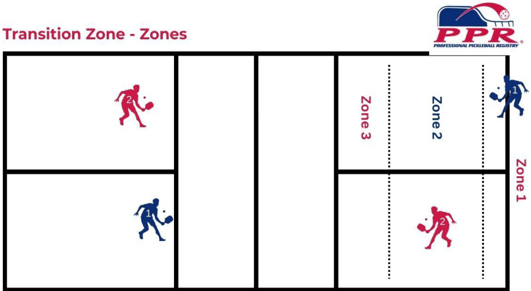  

Understanding and mastering these zones is essential in pickleball strategy. Higher level players are aware of the zones within the Transition Zone and are efficient and effective in anticipating and moving appropriately through these zones. Effective play in each of these zones requires different skills and strategic approaches.  

# Transition Zone Zones Video  

https://ppr.rewatch.com/video/xs4ukda4qym0qdl3-transition-zones-1-2-3 This video provides a detailed breakdown of strategies and techniques for transitioning in pickleball, particularly focusing on the third shot drop, fourth shot, and player positioning. It emphasizes the importance of player positions on the court, the triangular formation for better court coverage, and the significance of timing for optimal positioning. The summary highlights the need for assertiveness and shape in the third shot, the importance of holding positions, finding the right moment to poach, and maintaining proper weight distribution for effective shots. The text also discusses the footwork and positioning for players to better control the game, manage defensive and offensive plays, and make strategic shot selections. Additionally, it covers the significance of visual cues, footwork, and active paddle positioning for effective gameplay. It also discusses the importance of recognizing and reacting to each player's specific shots and movements.  

# Acceleration and Deceleration in the Transition Zone  

In pickleball, managing your movement through the transition zone – the area between the baseline and the Non-Volley Zone (NVZ) – is crucial. Knowing when to accelerate or decelerate your movement can significantly impact your effectiveness on the court. Here are some guidelines:  

# Accelerating Movement in the Transition Zone  

1. Approaching on Offensive Shots: Speed up when you hit a strong, offensive shot that forces your opponents into a defensive position, such as a deep and low shot. This is your opportunity to gain a positional advantage.   
2. Following a Successful Drop Shot: If you have executed a successful 3rd shot drop that is landing in the opponents' NVZ, recognize a potential weak return and look to accelerate and attack. This allows you to capitalize on the weak return.   
3. Responding to a High Ball: When your opponents return a high ball that you can attack, move quickly to position yourself for an aggressive shot.   
4. Creating Pressure: Quick movement can put pressure on your opponents, forcing them to make hurried decisions and potentially unforced/forced errors.  

# Decelerating Movement in the Transition Zone  

1. After a Defensive Shot: Slow down if you are forced to make a defensive or less advantageous shot. This gives you time to recover and prepare for the opponents' next shot.   
2. Reading Opponents' Preparation: If you see your opponent preparing for a strong offensive shot (like a smash), decelerate and prepare to defend.   
3. Adjusting for Shot Placement: If your shot placement is not ideal and you anticipate a strong return, slow down to maintain balance and readiness.   
4. Observing Opponents' Movement: Decelerate if you notice your opponents moving forward aggressively or getting into an advantageous position, allowing you to better defend their next shot.   
5. When Out of Position: If you find yourself out of position, it is often better to decelerate and focus on regaining your balance and court positioning.   
6. Crowded or Doubles Play: In doubles, if your partner is moving up and you need to cover more court, decelerate to maintain control and positioning.  

# Accelerate / Decelerate Transition Zone Video  

https://ppr.rewatch.com/video/xs4ukda4qym0qdl3-transition-zone This video provides a detailed breakdown of strategies and techniques for transitioning in pickleball, particularly focusing on the third shot drop, fourth shot, and player positioning. It emphasizes the importance of player positions on the court, the triangular formation for better court coverage, and the significance of timing for optimal positioning. The summary highlights the need for assertiveness and shape in the third shot, the importance of holding positions, finding the right moment to poach, and maintaining proper weight distribution for effective shots. The text also discusses the footwork and positioning for players to better control the game, manage defensive and offensive plays, and make strategic shot selections. Additionally, it covers the significance of visual cues, footwork, and active paddle positioning for effective gameplay. It also discusses the importance of recognizing and reacting to each player's specific shots and movements.  

# General Considerations for Transition  

1. Balance and Control: Always prioritize balance and control over speed. Rushing can lead to unforced errors or poor positioning.  

2. Footwork: Good footwork is key. Use shuffle steps or side steps for lateral movement allowing for quicker adjustments.  

3. Anticipation and Strategy: Anticipate the opponents' shots and choose your speed based on your strategic positioning and the current game situation.  

Effective movement in the transition zone is about making the right decision at the right time, based on the dynamics of the game. Practice and experience will enhance your ability to read the game and adjust your speed appropriately.  

# Poaching  

Poaching in pickleball refers to a strategic move where a player crosses over into their partner's area of the court to intercept and hit a ball that would typically be played by the partner. This tactic is commonly used in doubles play.  

Here are the key elements of poaching:  

When intercepting the ball, the primary idea is to catch the opponents off guard by unexpectedly hitting a ball that was heading towards your partner. During competitive play, it is often executed by the stronger player on the team or the player who has a better angle or position to make a more aggressive or effective shot.  

# Tactical  

# When to Poach  

1. Strong Offensive Position: If you are in a good position to hit a strong offensive shot, especially if your partner is not, poaching can be effective.   
2. Predictable Opponent Shots: If you can anticipate where the ball is going based on your opponents' patterns or body language, poaching can take them by surprise.   
3. Covering for Your Partner: If your partner is out of position, especially after hitting a shot that leaves them vulnerable, you can poach to cover the gap.   
4. Return and Volley Situations: After the return of serve is hit, the partner at the net can move over and poach to put immediate pressure on the team as they prepare for their 3rd shot.   
5. To Disrupt Opponents' Strategy: If your opponents are targeting your partner or have a rhythm going, poaching can disrupt their game plan.   
6. Confidence in Shot Making: Poach when you feel confident about making a solid, effective shot, especially if it can lead to a point.  

# Considerations for Poaching  

1. Communication is Key: It is important to communicate with your partner, both verbally and through signals, especially if you plan to poach frequently.   
2. Risk vs. Reward: Poaching can leave part of your court open, so consider the risk. If it is a high-risk situation with low reward, it might not be the best time to poach.   
3. Opponent's Skill Level: Be mindful of your opponents' ability to hit sharp angles or quick cross-court shots that could exploit the space you leave open.   
4. Avoid Over-Poaching: While poaching can be effective, doing it too often can make your team's movement predictable and easy to exploit.  

# After Poaching  

1. Reposition Quickly: After poaching, reposition yourself quickly to cover any open areas in your court.   
2. Assess the Outcome: Whether successful or not, assess the outcome of the poach to inform future decisions. In summary, poaching in pickleball is a tactical play used to gain an advantage, but it should be done strategically, considering both the potential benefits and risks. Effective  

poaching often hinges on good communication, anticipation, and the ability to quickly reposition after the shot.  

# Poaching Video  

https://ppr.rewatch.com/video/ee9nllctpl185vih-poaching-transition  

In this video, the speaker explains a pickleball drill that focuses on transitioning and staggering. The four players start in an uncomfortable position in the middle of zone two, and the feeder server initiates a cross-court feed, allowing the others to move towards the net and get into a staggered position. The cross-court players can only move forward after hitting a second ball. The drill involves setting up a poach and practicing hitting wider cross-court shots to keep the ball out of the middle. The speaker emphasizes the importance of using deeper balls to put pressure on opponents and avoid being invited up to the net.  

# Serve  

Serving Down the “T” Serving "down the T'' in pickleball refers to a specific serve direction. The term originates from tennis and describes a serve that is directed down the centerline of the court,  

towards the area where the center line intersects with the service line, resembling the letter "T".  

Here is what it involves in pickleball:  

1. Target Area: When serving down the “T”, the ball is aimed to travel along the centerline, ideally landing near the intersection of the center line and the service line at the far end of the court. This area is often less covered by the receiver.  

2. Strategic Advantage: This serve can be effective for several reasons:  

a. Reduced Angle for Return: It limits the angles that the receiver can use to return the serve, often resulting in a weaker or more predictable return.   
b. Surprise Element: If the receiver is anticipating a serve to the wider parts of the court, a serve down the “T” can catch them off guard.   
c. Backhand Pressure: If the receiver is weaker on their backhand side, serving down the “T” can force them to use their backhand, especially in singles play.  

3. Use in Doubles: In doubles, serving down the “T” can disrupt the receiving team's positioning and communication, as it is directed toward the middle of their formation.  

4. Precision and Control: This serve requires precision and control to ensure the ball lands in the correct service box without going out or into the NVZ.  

5. Mixing up Serves: Serving down the “T” is most effective when used in combination with other serving strategies, like serving wide or with different spins, to keep the opponents guessing and off-balance.  

6. Rule Compliance: Ensure that your serve complies with pickleball serving rules, like maintaining an underhand motion and hitting the ball below waist level. Incorporating serves down the “T” into your game can add a strategic layer to your serving, making it more difficult for opponents to predict and comfortably return your serves. As with any serving strategy, practice is key to consistency and effectiveness.  

# Serve Down the “T” Diagrams  

The following diagrams show the location of a serve down the “T” and the highest probability return off of the serve down the “T”. A player who can consistently hit a serve down the “t” can anticipate and be prepared for a return of serve that comes straight ahead or down the line. This  

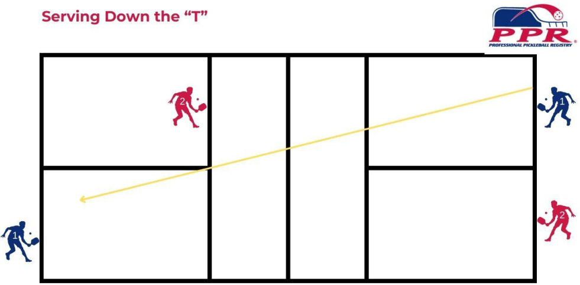  
CetPPRLevel1and Level2Certified.Find aworkshop pprpickleball.org  

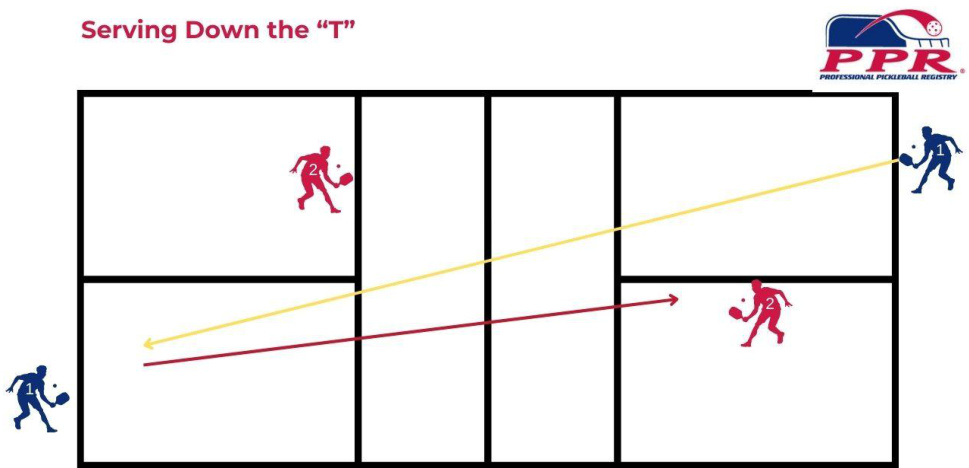  
GetPPRLevel1andLevel2Certified.Findaworkshop pprpickleball.org  

# Lob Serve  

The lob serve can be used as a tactical advantage to elicit a shorter return, enabling the serving team to take control of the point. The lob serve in pickleball offers several advantages for players. By executing a high, loopy serve that lands deep in the  

opponent's court, the lob serve can put pressure on the receiver, making it more challenging for them to return the ball effectively. This type of serve can create opportunities for the server to set up a strategic third shot and may result in mistakes from the receiver, ultimately giving the serving team an advantage in the point. Furthermore, the lob serve can keep opponents guessing and force them to move backward to return the ball, disrupting their positioning on the court. It is important to note that the effectiveness of the lob serve is highly dependent on its execution, with the benefits diminishing if the serve is too short. Therefore, when executed correctly, the lob serve can be a valuable addition to a player's repertoire, adding variety and unpredictability to their serving strategy.  

# Serving Videos  

Watch these videos to learn more about serve placement and variety.  

https://ppr.rewatch.com/collection/50206/serves  

# Returning the Serve  

# Return Down the Line  

Hitting the return down the line can position you closer to the middle of the court, offering a better opportunity to control the point. From this position, you can intercept shots, set up strong angles, and dictate play.  

# Return Positioning  

Return positioning refers to where you position yourself on the court to effectively return a serve. Proper positioning is critical for a successful return as it influences your ability to handle different types of serves and set up the subsequent play.  

Key aspects of Return Positioning include:  

1. Starting Position: Typically, you should start behind the baseline providing space and time for you to react to the serve. This gives you enough room to adjust to deep serves and react to shorter ones. Being too close to the baseline / inside the court might make it difficult to return deep serves effectively. The goal is to return and move forward to the NVZ. Going backwards to hit a return is counter-productive.  

2. Centering Yourself: Stand in a position that allows you to cover the largest possible area of your court. Usually, this means being slightly towards the center, but this can vary depending on your opponent's serving tendencies.  

3. Body Orientation: Face the server with your body positioned in a way that allows you to move quickly in any direction. Your feet should be shoulder-width apart, and your knees slightly bent for mobility. Starting in a “split-stance” allows for natural forward motion. The stance is personal preference as long as it does not inhibit the receiver's ability to move forward after the Return of Serve.  

4. Paddle Ready Position: Hold your paddle in front of you at about waist height, ready to move into a forehand or backhand stroke. This reduces reaction time.  

5. Watching the Server: Pay attention to the server's position and paddle movement. This can give you clues about the likely direction, speed, and spin of the incoming serve.  

6. Adjusting to the Serve: Be ready to move forward for short serves or sideways for wide serves. Good footwork and quick reactions are essential.  

7. Post-Return Positioning: After making the return, transition toward the Non-Volley Zone line positioning yourself in the best situation to play out the rest of the point.  

Effective return positioning is about being in the best possible spot to handle the serve and transition smoothly into your next shot. It requires awareness, anticipation, and quick movement.  

# Return Variety  

Return variety refers to the use of different types of return shots when responding to serves. Incorporating variety into your return game is a strategic approach to keep your opponents guessing and off balance. It involves changing up aspects like the pace, spin, depth, and placement of your returns.  

Key elements of return variety include:  

1. Changing Pace: Alternate between fast-paced and slower returns. A faster return can apply pressure, while a slower one might disrupt an opponent's timing and buy time for the returner to more effectively transition to the NVZ.   
2. Varying Depth: Mixing deep returns that push opponents back with shorter ones that might draw them forward, disrupting their positioning and strategy. Typically, it is not ideal to help opponents move forward to the NVZ; however, this can be determined by ability and/or mobility of opponents.  

3. Using Spin: Employing different spins (topspin, backspin, sidespin) to affect the bounce and trajectory of the ball, making it more challenging for the opponents to predict and return effectively.  

4. Altering Direction: Switching between cross-court, down-the-line, and middle returns to prevent opponents from anticipating where the ball will go.   
5. Strategic Placement: Targeting weak points of your opponents, like their backhand, or placing returns in areas that are difficult for them to reach.   
6. Adapting to Opponents: Tailoring your return strategy based on your observation of the opponents’ strengths, weaknesses, and playing style.  

By varying your returns, you can more effectively contend with different serving styles and strategies, prevent your opponents from settling into a comfortable rhythm, and create opportunities to take control of the point. Skilled players use return variety not only to neutralize the serve but also to set up advantageous situations for themselves in the ensuing rally.  

# Return Video  

https://ppr.rewatch.com/video/wnicydvtc336w2ng-return  

This video discusses the strategy and tactics of utilizing a down-the-line return in a game of tennis. It emphasizes the importance of this tactic in creating more opportunities and putting pressure on the serving team. The speaker explains how a deep, heavy return down the line can set up the player at the net to cross and poach, making it challenging for the opponent to redirect the shot cross court and get behind for a third shot drop. The speaker also demonstrates the correct movement and paddle positioning for effective poaching. Additionally, the text highlights the significance of learning to hit anywhere on the court and introduces the concept of stacking, emphasizing the value of the down-the-line return in this context. Overall, the down-the-line return is emphasized as a fundamental tactic for players of all levels to control the direction of the ball and create pressure on the opposing team.  

# Stacking  

Stacking refers to a strategic positioning of players in a specific formation during a doubles match to maximize team strengths while exploiting opponents weaknesses. Regular stacking is a common formation used in pickleball doubles.  

Here are some common aspects associated with Stacking:  

1. Right-Handed Server: In regular stacking, the team’s right-handed player serves first. The right-handed server stands in the right-back position (the “Even” side) at the start of the game.  

2. Left-Handed Partner: The left-handed partner stands in the left-back position (the “Odd” side) during the first serve. This positioning allows the team to have a forehand (for the right-hander) and a backhand (for the left-hander) in the middle of the court, which can be advantageous for covering a wider range of shots.  

3. Server's Rotation: After the initial serve, the server's team will rotate based on the outcome of the serve. If they win the point, the server and their partner will continue to rotate in the same direction, with the right-hander moving to the left-back position, and the left-hander moving to the right-back position. If they lose the point, they will also rotate, but in the opposite direction.  

Regular stacking is often used to create a stronger middle presence and allow the team to cover the center of the court more effectively, especially when the server can follow up their serve at the net with their dominant hand (forehand for a right-hander, backhand for a left-hander).  

It is important to note that stacking can only be implemented at the start of a game or after a side out (when the receiving team wins the serve), and it must follow the proper rotation rules. The main objective is to maximize court coverage and take advantage of the strengths and preferences of each player on the team.  

# Signal  

Signal stacking is a strategy used in pickleball doubles to communicate with your partner about the type of shot you plan to hit or your intended movement on the court during a point. This communication helps ensure that both players are on the same page and can anticipate each other's actions, leading to better coordination and teamwork. Signal stacking typically involves using hand signals or verbal cues to convey specific information.  

Here are some common aspects of signal stacking in pickleball:  

1. Shot Selection Signals: During a rally, players can use signals to communicate their shot choices. For instance, a player might signal their partner to prepare for a lob, a drop shot, a dink, or a smash. This helps the partner anticipate the shot and be in the right position.  

2. Movement Signals: Signal stacking can also involve indicating movement intentions. For example, a player may signal their partner to switch sides, indicating that they are going to cover the opposite side of the court. This can be particularly useful when transitioning between offensive and defensive positions.  

3. Nonverbal Cues: Some players may prefer nonverbal cues like tapping the shoulder, using hand signals, or even developing a secret code between partners to communicate specific strategies and tactics.  

4. Verbal Communication: In addition to hand signals, players can also use verbal cues to communicate with their partners. They may shout out "yours" to indicate that their partner should take the shot or "mine" to signify that they will handle the shot.  

Signal stacking is particularly important in doubles play because it helps prevent confusion and ensures that both partners are in sync, maximizing their chances of winning points. It requires good communication, trust, and practice between doubles partners to be effective. It's important to develop a system that works well for both players and allows for quick, clear communication during fast-paced pickleball matches  

# Half  

Half stacking is a strategic formation used in pickleball doubles that involves a slight variation of the regular stacking formation. In half stacking, one player on the serving team starts the point in a different position than the standard right-back position.  

Here are some key elements of how half stacking works:  

1. Right-Handed Server: Similar to regular stacking, the right-handed player serves first from the right-back position (deuce court) at the start of the game.  

2. Left-Handed Partner: The left-handed partner starts in the middle of the court, closer to the centerline, during the first serve. This positioning aims to take advantage of the left-hander's forehand (which is often stronger) and gives them a better opportunity to control the middle of the court.  

3. Server's Rotation: After the initial serve, the serving team will rotate based on the outcome of the point, just like in regular stacking. If they win the point, the server moves to the left-back position, and the left-handed partner moves to the right-back position. If they lose the point, they also rotate, but in the opposite direction.  

The key difference in half stacking is the starting position of the left-handed partner, who is closer to the centerline during the first serve. This formation aims to maximize the use of the left-handed player's strengths in the middle of the court while maintaining the overall court coverage.  

Half stacking can be a strategic choice, especially if the left-handed player has a strong forehand and can control the middle effectively. However, it also requires clear communication and coordination between the partners, as the initial positioning is  

different from what players typically encounter in regular stacking. As with any formation, it's essential to practice and adapt the strategy to your team's strengths and the specific challenges posed by your opponents.  

# Return Placement when Stacking  

Handling the return when stacking in pickleball involves specific strategies and responsibilities for each player on the serving team. In pickleball, stacking is a formation used in doubles play to maximize court coverage and take advantage of players' strengths. Here's how you typically handle the return when stacking:  

1. Serve: The right-handed player (often the stronger server) serves first from the right-back position (deuce court).   
2. 2. Left-Handed Partner: The left-handed partner starts closer to the centerline in the middle of the court during the first serve. Their positioning is intended to make the most of their forehand and help control the middle of the court.   
3. Server's Rotation: After the serve, the serving team rotates based on the outcome of the point, just as in regular stacking. If they win the point, the server moves to the left-back position, and the left-handed partner moves to the right-back position. If they lose the point, they also rotate, but in the opposite direction.  

When it comes to handling the return in a stacking formation:  

1. Initial Return: The left-handed partner is often responsible for the initial return of the serve, as they are positioned closer to the centerline and can easily cover the middle of the court. They should aim to return the serve aggressively, placing it deep and accurately.  

2. Support from the Server: The right-handed server should be prepared to cover the side of the court (deuce or ad court) where the return is likely to go. If the return is directed towards the left-handed partner's side, the server should be ready to cover the middle and help defend against any angled shots.  

3. Quick Transition: After the initial return, both players need to transition quickly to their respective stacking positions. If the return comes back to the server's side, the left-handed partner should move to the right-back position, and the server should move to the left-back position.  

4. Communication: Clear communication between partners is essential. Both players should call out who will take the ball when it's near the middle to avoid confusion and ensure proper court coverage.  

5. Adapt to the Situation: Be prepared to adapt based on the opponent's return and the specific circumstances of the point. If the return is weak or sets up an opportunity for an attack, the serving team can take advantage of it.  

Remember that stacking in pickleball aims to maximize your team's strengths and court coverage. Effective communication, quick transitions, and smart shot selection are key elements to successfully handling returns in a stacking formation. Practice and coordination with your partner will help improve your performance in this strategy.  

# Stacking Videos  

Watch the following videos for information about stacking strategies.  

https://ppr.rewatch.com/collection/50227/stacking  

# Considerations for Doubles  

# Timing and Trust When Playing Doubles  

Communication, timing of movement and more, and trust are critical aspects of a good team. Timing and trust come into play as non-verbal communication between partners creating opportunities for them to surprise and, possibly, intimidate their opponents. Timing is important for some of the following reasons:  

1. Shot Coordination: In pickleball, both players need to be in sync with their shots. Timing shots allows you and your partner to coordinate movements and hit the ball at the right moment. This coordination ensures that you both cover the court effectively and avoid leaving any gaps for your opponents to exploit.  

2. Building Momentum: When partners are in sync with one another there is a smooth flow of play that can put pressure on the opponents. This allows for control over the pace of the game and opportunities to maintain a strategic advantage.  

3. Trust: Trust between partners helps with court coverage knowing your partner's ability to cover their designated areas on the court allows for players to focus on their own responsibilities. This helps to prevent confusion or hesitation.  

4. Shot Selection: Trusting your partner's shot selection is crucial for effective teamwork. When one can trust a partner's judgment, one can anticipate shots and make appropriate moves to complement the strategy.  

5. Communication: Trust facilitates open and effective communication. Partners can openly discuss strategies, tactics, and areas for improvement without fear of judgment or criticism. This allows for better problem-solving and adjustment during gameplay, leading to improved performance as a team.  

6. Emotional Support: Trust between partners extends beyond the game itself. It involves supporting and encouraging each other both on and off the court.   
7. Risk-Taking: Trusting one's partner allows for taking calculated risks during play. Trust gives one the confidence to attempt more challenging shots and strategies, knowing the partner will be there to support and adapt accordingly.  

# Identify Strengths - Individual and Team  

Capitalizing on your strengths when playing pickleball can give you a significant advantage on the court. Here are some strategies to make the most of your strong points  

1. Play to your Dominant Side: If you have a strong forehand or backhand, use it as your primary weapon. Direct your shots to your opponent's weaker side, forcing them to hit returns to your strong side. As a team, determine who will predominantly play which side of the court and create opportunities for each player to receive their strongest shot.  

2. Serve Effectively: If you have a powerful or accurate serve, use it to your advantage. Mix up your serves by using different spins, speeds, and placement to keep your opponents guessing and off balance. As a team, communicate about favorite serve types so that your partner is prepared for potential return response.  

3. Net Play: If you have good reflexes and quick hands, consider being aggressive at the net. Attack the net and look for opportunities to put away volleys and smashes, especially if you have good touch and control. If one partner is better at attacking, the other partner should focus on creating opportunity by being steady from the NVZ, keeping shots unattackable and forcing opponents to hit the ball high for partner to attack.  

4. Mobility and Court Coverage: If you are quick and agile, use your speed to cover the court effectively. Be ready to reach wide shots and return them with precision, frustrating your opponents by getting to seemingly unreachable balls. Communicate as a team as to who will cover the majority of the lobs and do the majority of the running.  

5. Consistency: If you are a consistent player who rarely makes unforced errors, focus on playing a steady, error-free game. Force your opponents to take risks and make mistakes by consistently returning their shots with accuracy. This is a good balance with a partner who is more aggressive and able to take advantage of high balls / finishing the point.  

6. Communication (in doubles): If you are playing doubles, communication with your partner is crucial. Work on your teamwork and positioning to exploit the gaps and weaknesses in your opponents' defense.  

7. Strategy and Shot Selection: Analyze your opponent's weaknesses and adjust your game plan accordingly. If you are a good strategist, you can set up points that play to your strengths and exploit your opponent's vulnerabilities. As a doubles team, trust your partner’s interpretation / analysis and be willing to try until it proves effective or ineffective. As a team it is important that both players are comfortable making strategic suggestions and game plans.  

8. Mental Toughness: If you have strong mental resilience, stay focused and positive, even in challenging situations. This can help you maintain your game plan and capitalize on your strengths, while your opponent may become frustrated.  

9. Adaptability: Be adaptable and willing to adjust your game plan as needed. If your strengths are not working against a particular opponent, do not hesitate to switch up your tactics and play to their weaknesses.  

10.Practice and Training: Continuously work on improving your strengths through practice and training. This can involve honing your technique, fitness, and mental skills to become an even stronger player. As a team, pracitive like you want to play, setting each other up for success and creating comfortable communication, timing and trust.  

Remember that pickleball is a dynamic sport, and your strengths may not always guarantee success. You should also be prepared to play defensively and work on improving your weaknesses to become a well-rounded player. Adapting your game to different opponents and situations is key to long-term success in pickleball.  

# Expose Weaknesses of Opponent(s)  

Exposing the weaknesses of your opponent in pickleball, like in any other sport, requires a combination of strategy, observation, and adaptability.  

Here are some tips on how to identify and exploit weaknesses of opponent(s):  

1. Observation: Pay close attention to your opponent's play from the beginning of the match. Look for patterns in their game, such as their preferred shots, court positioning, and movement patterns. This initial observation can help you identify potential weaknesses.  

2. Target their Weaker Side: If your opponent has a weaker forehand or backhand, try to direct your shots to that side. For example, if they struggle with their backhand, hit the ball to their backhand side more often to force errors.  

3. Vary Your Shots: Mix up your shots by using different angles, speeds, and spins. This can make it difficult for your opponent to anticipate your next move and exploit their vulnerabilities.  

4. Change the Pace: Alter the pace of your shots by alternating between slow and fast shots. This can disrupt your opponent's rhythm and make it challenging for them to set up for their shots.  

5. Move Opponent around the Court: Make your opponent move by hitting the ball to different areas of the court. Forcing them to cover more ground can tire them out and increase the likelihood of errors.  

6. Use Drop Shots: If your opponent struggles with quick, short shots, consider using drop shots to catch them off guard. This can force them to move forward quickly and put pressure on their agility. Be careful that you are not drawing a player forward but, in fact, are forcing a weak shot as a result of lack of mobility.  

7. Serve Strategically: Your serve is an excellent opportunity to exploit weaknesses. Try serving to their weaker side or using different types of serves, such as a low slice or a high lob, to keep them guessing.  

8. Psychological Tactics: Stay composed, stay positive, and avoid showing frustration. Sometimes, opponents make mistakes when they feel pressured or discouraged.  

9. Adapt during the game Be flexible in your approach. If you notice that a particular strategy is not working, do not hesitate to adjust your tactics and try something different.  

10.Communicate with your Partner (in doubles): If you are playing doubles, communicate with your partner to identify and exploit weaknesses in your opponents' game. Work together to create opportunities for attack.  

Remember that pickleball is not only about exploiting your opponent's weaknesses but also about playing to your strengths. Focus on your own game and be prepared to adapt your strategy based on your opponent's responses. Good sportsmanship is also important, so maintain a respectful attitude throughout the match.  

# Closing the Lesson  

# Static Cool Down  

A static cool down after playing pickleball is an essential part of your post-game routine. It helps your body transition back to a resting state, aids in recovery, reduces muscle soreness, and can improve flexibility.  

Static Stretching (10-15 minutes) at the end of a session is a beneficial element for keeping self and/or students in the best playing shape possible. Focus on stretching major muscle groups that were used during play, such as calves, hamstrings, quadriceps, hip flexors, glutes, back, chest, shoulders, and arms. Each stretch should be held for about 20-30 seconds. Avoid bouncing or jerking; instead, stretch to the point of mild tension and hold it there.  

Here is a typical static cool down routine:  

1. Calf Stretch: Lean into a wall with one foot behind the other and gently stretch the calf of the back leg.   
2. Hamstring Stretch: Sit on the ground and gently reach for your toes, keeping your legs straight.   
3. Quadriceps Stretch: While standing, pull one foot up behind you towards your buttocks, stretching the front of your thigh.   
4. Hip Flexor Stretch: Perform a lunge and lean forward, stretching the hip flexor of your back leg.   
5. Back and Shoulder Stretch: Use arm movements that stretch the shoulders and upper back, such as pulling an arm across your chest or interlocking your hands behind your back.   
6. Wrist and Forearm Stretch: Extend your arm, gently pull back on the fingers, then press them downwards.   
7. Breathing and Relaxation: Finish with deep, slow breaths to help relax and bring your focus back to a resting state.  

A proper static cool down can significantly aid in your recovery process and get you ready for your next pickleball game or activity. Remember, these stretches should feel relaxing and not cause pain. If any stretch causes discomfort, ease off to a more comfortable position.  

# Lesson Recap  

Here are some suggestions for how a coach can effectively recap the lesson and the lesson objectives:  

1. Start with a Brief Introduction to the Conclusion: Begin by summarizing the overall objective of the lesson. For example, if the focus was on improving shot selection and strategy, you can say, "In today's lesson, we worked on enhancing our shot selection and strategic decision-making on the court."  

2. Recap the Main Concepts: Highlight the key points and techniques covered during the lesson. Break down the information into smaller, digestible pieces. Use clear language and provide examples to reinforce understanding. For instance, if the lesson covered the importance of maintaining a proper ready position and making effective shot choices based on court positioning, you can say, "We learned that being in a balanced ready position allows us to react quickly to our opponent's shots. Additionally, we discussed how to assess the court and make smart shot choices that exploit our opponent's weaknesses."  

3. Review any Specific Drills or Exercises: Remind the players of the drills or exercises practiced during the lesson. Emphasize the purpose of each drill and how it relates to the overall lesson objective. This helps reinforce the practical application of the concepts learned. For example, if the drills focused on practicing different shot placements and angles, you can say, "During the lesson, we worked on drills that allowed us to practice hitting cross-court shots, down-the-line shots, and drop shots. These drills helped develop our ability to vary our shot selection and keep our opponents off balance."  

4. Address Common Challenges or Mistakes: Discuss any common challenges or mistakes observed during the lesson. This helps players become aware of areas they need to improve and provides an opportunity for clarification. Offer guidance on how to overcome these challenges and correct any recurring mistakes. For instance, if players struggled with timing their shots, you can say, "Some of you had difficulty timing your shots correctly, resulting in missed opportunities. Remember to anticipate the trajectory of the ball, adjust your positioning and swing accordingly."  

5. Encourage Questions and Feedback: Create an open and supportive environment where players can ask questions and seek clarification. Encourage them to share their thoughts and experiences from the lesson. This fosters engagement and ensures that everyone is on the same page.  

6. Summarize the Key Takeaways: Conclude the recap by summarizing the main takeaways from the lesson. Reinforce the importance of practicing the skills learned and integrating them into gameplay. Encourage players to reflect on how they can apply these lessons in future matches or practice sessions.   
7. By following these steps, a coach can effectively recap a pickleball lesson, reinforce the key concepts, address challenges, and keep players engaged and motivated to improve their skills on the court.  

# Homework  

After a pickleball lesson, the homework can vary depending on the specific areas of focus during the lesson.  

Here are some general homework suggestions:  

1. Practice the Skills Taught in the Lesson: Spend time practicing the specific skills and techniques that were covered during the lesson. This could include practicing serves, volleys, dinks, or any other skills that were taught.   
2. Watch Pickleball Videos: Watch instructional pickleball videos online to gain more knowledge and understanding of the game. This can help reinforce the lessons learned during the class and provide additional tips and strategies.  

3. Play with a Partner: Find a partner to play pickleball with outside of the lesson. This will allow you to practice the skills in a real game situation and further develop your gameplay.  

4. Review the Rules: Take some time to review the rules of pickleball to ensure you have a clear understanding of how the game is played. This will help you become a better player and avoid any rule violations during matches.  

5. Physical Conditioning: Engage in physical conditioning exercises to improve your overall fitness and stamina for pickleball. This could include cardio exercises, strength training, and flexibility exercises.  

Remember, the key to improving in pickleball is consistent practice and dedication. By incorporating these homework suggestions into your routine, you will be on your way to becoming a better pickleball player. As the coach, you want to tailor the homework assignment to align with the lesson using specific criteria.  

# Pickleball Drills  

We have recorded videos that demonstrate how to integrate pickleball drills into your pickleball coaching lessons. There are many different types of pickleball drills you can use with participants depending upon their skill level, experience, and ability to move around the court.  

As a pickleball coach, continuously evolving your training repertoire is essential to keep your players engaged, challenged, and improving. Whether you are coaching Beginners who are just learning the basics or advanced players fine-tuning their strategies, introducing new drills can significantly enhance their skills and understanding of the game. In this section, we will explore a variety of new drills designed to target specific aspects of pickleball play.  

From drills focusing on footwork and agility to those that sharpen shot accuracy and strategic play, each exercise has been crafted to address key areas crucial for pickleball success. These drills will not only boost the physical capabilities of players but also enhance their tactical awareness and decision-making on the court.  

Our focus is on the intermediate to advanced level drills with a focus on more complex skills such as effective court positioning, shot placement, and mastering the art transitioning, exploiting weaknesses, finding strengths and more. We will also delve into drills that improve reaction time, anticipation of certain shots, and develop a strategic mindset, essential for competitive play.  

Moreover, we will introduce fun yet challenging drills designed to keep players engaged and enjoying their training sessions. These drills will not only help in skill development but also foster a sense of teamwork and camaraderie among players.  

Here is a written list of additional drills to help generate new ideas to elevate your coaching and add to your coaching toolkit:  

1. One player starts at the NVZ and the other player in the back portion of Zone 1 of the transition zone. The player in the NVZ feeds a semi-aggressive feed and then once the player in transition has hit 2 blocks or re-sets, the point is live. The player transitioning has to get to 7 before the player at the NVZ gets 11.  

2. One player starts at the NVZ and the other player in the back portion of Zone 1 of the transition zone. The player at the NVZ feeds a semi-aggressive feed and then once the player has hit 2 blocks or re-sets AND is neutralized at the NVZ, the transitioning player earns a bonus point. The point is played out and the first player to 11 points wins the game.  

3. One player hits a dink down the line (straight ahead) and the partner hits it back to the person who fed the ball and then the feeder keeps the rally going to the cross-court (diagonal); the partner hits back cross-court to the feeder and then straight ahead again. Now that player has had his/her $^{\circ}3$ dinks”. Then the player who was moving is now standing in place and hitting one down the line, one cross-court and another down the line. Take turns and then do the same drill from the other side of the court.  

4. All players are at the NVZ and one player starts the feed to the player who is cross-court (or diagonally) across from the feeder. The first 5 shots must bounce in the NVZ before the point starts and then anything goes. The first team to get to 11, win by 2, wins the game  

# Pickleball Games  

We have recorded videos that demonstrate how to integrate pickleball games into your pickleball coaching lessons. There are many different types of pickleball games you can use with participants depending upon their skill level, experience, and ability to move around the court.  

Watch videos and read the transcripts of the following pickleball games.  

Capture The Net   
Transition   
The Zones (Transition)   
Keeping Opponents Back (4th Shot)   
Poaching   
Jackpot (NVZ)  

# Pickleball Games  

  

# Videos  

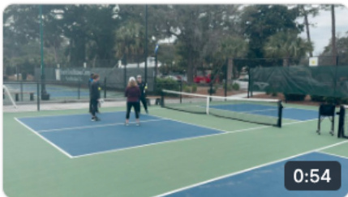  

GAMERECAP3-4  

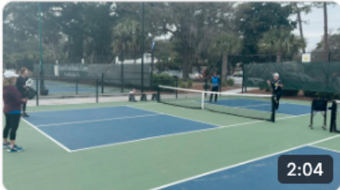  

Capture the Net - GAME  

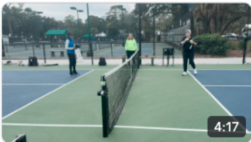  

Jackpot(NVZ)-GAME  

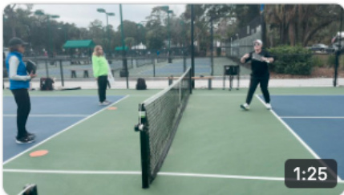  

Corner to Corner (NVZ) - GAME  

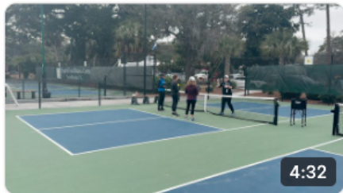  

ThreeFour(Return)-GAME  

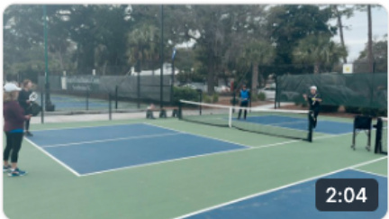  

Capture the net - GAME  

If you are looking to inject some fresh energy and excitement into your coaching sessions, introducing new games is a fantastic way to do it. Whether you are coaching beginners eager to learn the basics or advanced players looking to refine their skills, incorporating innovative and fun games can significantly enhance their learning experience and enjoyment of the sport.  

In this collection, we will explore a variety of engaging games designed to target specific skills and strategies in pickleball. These games are not only fun but also highly effective in reinforcing important techniques, improving strategic thinking, and boosting overall gameplay.  

The games suitable for intermediate and advanced players will have an emphasis on the more nuanced aspects of pickleball. These include strategic shot placement, advanced serving and return strategies, and mastering the mental game. The games will challenge players to think on their feet, anticipate their opponent's moves, and apply advanced tactics in a competitive but enjoyable environment.  

Additionally, we have included team-based games that encourage collaboration, communication, and teamwork. These games are not only great for skill development but also for building a sense of community and sportsmanship among players. The goal of these games is not just to enhance physical skills but also to nurture a love for pickleball and a spirit of continuous improvement. Whether you are looking to revitalize your current training regimen or seeking new methods to motivate your players, these games are an excellent resource.  

# Conclusion  

Know others who might be interested in becoming a certified pickleball instructor? Please share this infographic on your social media platforms and elsewhere!  

  

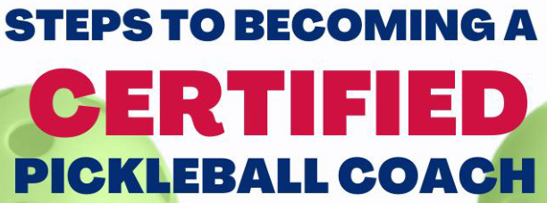  

# JOINPPRASANEWMEMBER  

1  

Visit pprpickleball.orgLpricing. Pay annual dues of St10/year Additionalinsurancepolicy  

# REGISTERFORA CERTIFICATION WORKSHOP  

Find a date and location Sign up for additional opportunities  

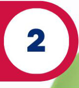  

# JOINUSAPICKLEBALLASANEWMEMBER  

  

Visit usapickleball.org/memberships Pay annual duesS35/year Obtainmember ID#  

ACCESSTHEPPRBUNDLEFROMTEACHABLE Dowload study guide and handbook ·Watch online videos and take quizzes  

  

# ATTENDTHECERTIFICATIONWORKSHOP  

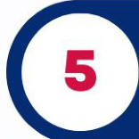  

Observeandcreatelessonswithclinician Networkwith otherpickleball coaches  

# PASSTHECOACHINGASSESSMENT BY THEPPR CLINICIAN  

Teach a one hour lesson to demonstrate your coaching  

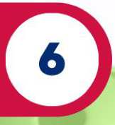  

# TAKETHEPPRCERTIFICATIONONLINEEXAM  

7  

96 question openbookonline exam Certified coachesneed>75%passrate Certifiedprosneed>9o%passrate  

# Get Certified at pprpickleball.org  

Click the link to see the schedule of upcoming workshops.   
Interested in hosting a Level 2 workshop at your facility or in your area? Click here to complete the form.  

Want to help your fellow PPR instructors? Click here to submit your favorite drill or game.  